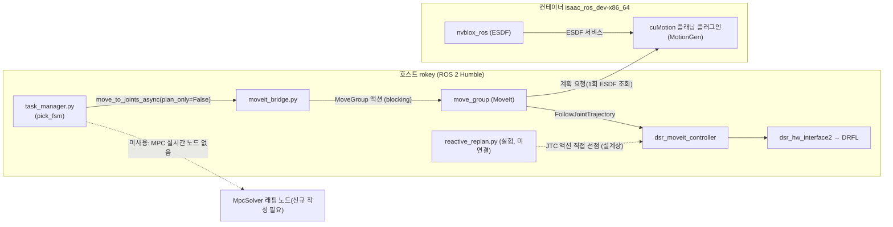
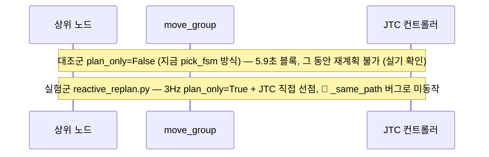

<!-- meta
updated: 2026-08-10
status:  RMPflow 도입 검토 과정에서 move_group 실행모델을 실기로 재확인한 기록
owns:    move_group 실행모델 한계 · 그리퍼 SRDF 자기충돌 원인/해결 · RMPflow vs 실제 설치 비교
-->

# move_group 구조·기능·한계 — cuMotion/RMPflow 검토 기록

> 출처: `src/cumotion/README.md`(⭐-2, ⭐절), `md/state.md`. 이 문서는 그 기록을 구조도로
> 재배열한 것 — 새 실기 사실은 없다. HTML(mermaid) 버전: 대화 중 Artifact로 발행됨.
> **RMPflow 원리 + MPPI-MPC 비교(NotebookLM 교육용 digest)**: [[ws/cobot2/2026-08-11-rmpflow-reactive-motion-digest]]

## 요약

| | 상태 |
|---|---|
| RMPflow | 🔴 이 ws의 cuRobo 설치에 없음(grep 0건). 실시간 솔버는 MPC(`MpcSolver`) |
| 그리퍼 SRDF 자기충돌 | 🔴 좌↔우 교차쌍 9개 중 4개 누락 — 닫힌 자세 계획이 조용히 버려지는 원인 후보 1순위 |
| `reactive_replan.py` | ✅ 확인됨 — `task_manager.py`가 import 안 함, pick_fsm과 미연결(팀원 개인 실험) |

## 1. 아키텍처 — 지금 실제로 도는 경로는 하나뿐



## 2. move_group 실행 모델의 한계 (실기 확인)

- **동시 goal을 거부하지 않고 FIFO 큐에 쌓는다.** 2초마다 goal 생성, 5.9초마다 소비 →
  8초→30초→72초로 지연 발산.
- **큐는 노드를 죽여도 안 비워진다** — move_group 프로세스 안에 남아 계속 실행. 실험 사이
  move_group 재시작 필수.
- **`cancel()`은 가장 최근 goal만 취소** — 실행 중인 것은 가장 오래된 goal이라 안 취소됨.
- **`plan_only=False`일 때 start_state 무시** ("Ignoring the state supplied as start state") →
  인계(lookahead) 예측이 원리적으로 불가능. `plan_only=True`가 필수인 이유.

### 대조군 vs 실험군



## 3. 그리퍼 SRDF 자기충돌 — 원인과 해결

cuMotion은 계획에 **성공**하는데(`Trajectory success!`) MoveIt 재검증에서 32개 웨이포인트
전부가 무효 처리되고 조용히 실행이 건너뛰어진다(우리 노드엔 에러가 안 옴).

```
ERROR: Computed path is not valid. Invalid states at index locations: [0 1 2 ... 31] out of 32
INFO:  Found a contact between 'rg2_left_inner_knuckle' and 'rg2_right_outer_knuckle'
```

**원인**: `m0609_rg2.srdf`의 좌↔우 교차쌍 9개 중 4개가 비어 있음. MoveIt Setup Assistant는
무작위 샘플링으로 "한 번도 안 부딪힌 쌍"만 자동 면제하므로, 이 4쌍은 실수가 아니라 **어떤
자세(닫힌 그리퍼로 추정)에서 실제로 겹쳐서** 제외된 것이다.

| 누락 쌍 | 확인 |
|---|---|
| `rg2_left_inner_knuckle` ↔ `rg2_right_outer_knuckle` | 🔴 로그가 지목한 쌍 |
| `rg2_right_inner_knuckle` ↔ `rg2_left_outer_knuckle` | 🔴 대칭쌍 |
| `rg2_left_inner_knuckle` ↔ `rg2_right_inner_finger` | 🔴 없음 |
| `rg2_right_inner_knuckle` ↔ `rg2_left_inner_finger` | 🔴 없음 |

(2026-08-10 `m0609_rg2.srdf` 직접 확인 — 나머지 5쌍은 정상 등록됨.)

**해결 절차 (무작정 `reason="Never"` 추가 금지 — 자기충돌 검사 자체를 끄는 것이라 실기 안전 영향)**:
1. **공짜 판별 실험** — 그리퍼를 **열고** 같은 궤적 재실행. 측정 당시 `rg2_finger_joint = 0.757 rad`
   (닫힘 쪽). 경고가 사라지면 "닫힌 자세 메시 겹침"으로 확정 → SRDF 안 건드리고 우회 가능
   (그립 전/후에만 재계획, 닫힌 채 이동 구간은 재계획 제외).
2. 그래도 필요하면 `rg2_finger_joint`의 실사용 범위로 한정해 Setup Assistant 자기충돌 샘플링을
   재생성 — 전체 범위를 `Never`로 뭉개지 말고 `Default`(샘플링 기반)로.
3. 급하면 4쌍 추가 후 개폐 전 범위 FCL 스윕으로 거짓양성/실제위험을 구분한 뒤 커밋.

⚠️ 이 문제는 `reactive_replan.py`·`goal_setter_replan.py` **양쪽 다** 영향 — 재계획 루프
구조와 무관한 더 아래 계층 문제. 루프를 어떻게 고치든 이것부터 풀어야 한다.

## 4. RMPflow(원문 제안) vs 실제 설치

| | 원문 보고서 전제 | 이 ws 실제 |
|---|---|---|
| 실시간 솔버 | RMPflow | 🔴 없음(grep 0건). 있는 건 cuRobo `MpcSolver` |
| ROS 2 노드 | 즉시 사용 가능 | 🔴 MPC 래핑 ROS 노드 없음(`isaac_ros_cumotion` launch 8개 중 없음) — 신규 작성 필요 |
| 실행 중 재계획 | RMPflow 기본 제공 | `reactive_replan.py`가 직접 설계 중(미완성) |
| GPU 여유 | 우려 대상 | 실측 2.5GB/8GB 사용 — 문제 아님 |

## 5. 다음 단계

1. 그리퍼 **열고** 같은 궤적 재실행 — SRDF 원인 1차 판별 (실기 무해, 최우선)
2. `reactive_replan.py`를 pick_fsm과 **시뮬레이션 상에서** 연결 테스트 — `_same_path` 버그 재현
3. SRDF 자기충돌 4쌍 처리 방식 결정 후 커밋
4. nvblox ESDF ↔ move_group PlanningSceneMonitor 공유 여부 실기 확인 (미검증)
5. MPC(=원문의 "RMPflow") 도입은 위 항목 끝난 뒤 별도 스파이크 — 지금 우선순위 아님
