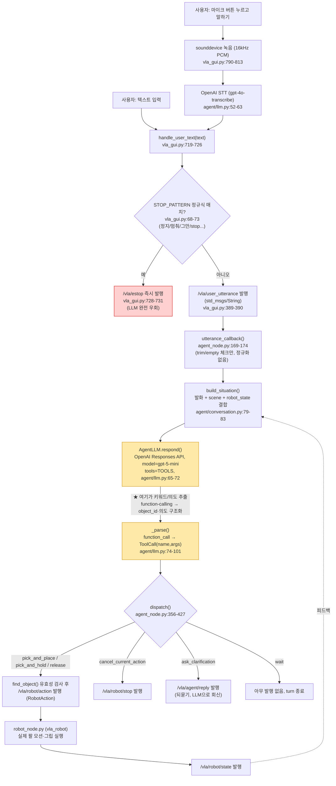

<!-- meta
updated: 2026-08-10 (9차 개정 — §0-H: **VLA 입력 범위 확정(사용자 지시).** VLA는 "어떤
         물체를 집을지·그립을 수행할지·어디에 놓을지" 3개만 담당한다. 즉시정지·승인·속도·
         backdrive·그리퍼 복구는 물리 버튼/rqt 전용으로 명시 고정 — VLA 경로를 열지 않는다.
         §6-3(정지 경로를 브리지가 직접 부를지)의 답이 이걸로 났다: 안 부른다.
         8차: §0-G: **아키텍처 전제가 바뀌었다.** 사용자 확인:
         VLA 음성/텍스트 노드와 `pick_fsm` 이 **같은 PC**에서 뜬다(두 PC + 휴대폰 핫스팟
         전제가 아니다). §3-1(도메인/DDS)·§3-3(대역폭·해상도·JPEG 품질) 전체가 이 새
         구성에서는 **해당 없음**으로 강등 — 삭제하지 않고 "다중-PC 전용" 딱지만 붙인다.
         §3-2(캘리브 오차 합산)도 VLA가 자기 카메라를 안 쓰면 무의미해진다. 카메라 구성
         (VLA가 D435i를 그대로 보는지, 별도 카메라가 있는지)은 **아직 미확인** — §0-G 참고.
         7차: §0-F: `M0609_VLA_system`이 같은 remote 의 다른 clone(별도
         repo 아님)임을 `git remote -v`로 확인. 그 clone 브랜치 작업으로 이 세션의 커밋 안 된
         변경(venv 설치 절·env.sh·PYTHON_ENV_CONVENTION.md)이 소실된 사고 기록 + 재발 방지
         (커밋까지 하기, 사본 금지). 브리지 계약 문서를 `md/vla-bridge-contract.md` 하나로
         통일(사본 삭제).
         6차: §0-E 음성 승인(`approve_listener_node`) 신설, 브리지 위치 재확인.
         5차: `2026-08-10-integ-plan.md`(§0-D)와 `2026-08-10-fsm-merge.md`(§9) 를 여기로
         병합 후 원본 삭제. "원본 = M0609_VLA_system" 보류 해제, place 3종 지원 추가,
         ~/.local 오염 정리)
status:  live (§2 지시 채널 구현됨 2026-08-09 — §0-C. place 는 2026-08-10 — §0-D. 음성 승인은
         2026-08-10 — §0-E. **아키텍처가 단일 PC 로 바뀌어 §9 의 "브리지 필수" 결론도
         재검토가 필요하다** — §0-G. §5 선정 로직은 여전히 미착수, 단일 PC 에서는 오히려
         우선순위가 더 올라간다.)
owns:    M0609_VLA_system ↔ cobot2_ws 통합 · 역할 경계 · 지시 채널 계약 · 물체 선정(target selection) 설계.
         이 ws 의 VLA 통합 관련 md 는 **이 문서 하나**로 통일한다 — 새 통합 관련 파일을
         또 만들지 말고 여기 개정 절(0-A/0-B/0-C/0-D/0-E...)을 추가한다.
-->

# VLA 통합 — 필요 부분 정리 (2026-08-08, 2026-08-10 실측 갱신)

## 0-G. 🔴 2026-08-10 — 아키텍처 전제 변경: 두 PC+핫스팟 → **같은 PC**

> 이 절 아래 §0~§9는 전부 **"VLA는 다른 PC, 휴대폰 핫스팟으로 연결"**을 전제로 쓰였다.
> 사용자가 확인한 지금 구성은 다르다: **VLA(음성/텍스트 입력 에이전트)와 `pick_fsm`이 같은
> PC에서 뜨고, VLA가 집을 물체를 정하면 FSM이 이어받아 GraspGenX + 모션플래닝으로 수행한다.**
> 과거 절을 지우지 않는다(히스토리 로그 원칙, 문서 상단 안내) — 대신 아래에 **무엇이
> 무효화되는지**만 표로 못박는다.

### 무효화/강등되는 것

| 절 | 내용 | 같은 PC에서 |
|---|---|---|
| §3-1 | `ROS_DOMAIN_ID`/DDS 프로파일을 VLA 쪽에 맞춘다 | **무의미.** 같은 PC면 한 도메인, 한 DDS 참여자 그룹 — 맞출 대상이 없다 |
| §3-3(a~e) | D435i 압축영상을 VLA PC로 전송, 대역폭·JPEG 품질·해상도 제약 | **무의미.** 네트워크 경계 자체가 없으니 대역폭 예산이 없다. 영상이 필요하면 **로컬 토픽 구독**으로 충분 — 압축할 이유가 없다(§3-3(b)의 5.7 Mbps 예산은 핫스팟 전용 문제였다) |
| §3-2 | C270(VLA)·D435i(우리) 두 캘리브의 오차 합산 (`match_tolerance_m` 0.06) | **VLA가 별도 카메라(C270)를 계속 쓰는지에 달렸다 — 미확인.** 안 쓰고 우리 D435i·YOLO 출력만 본다면 이 절 전체가 사라진다 |
| §9-2 (판단: "B를 유지하고 이 ws엔 발행자만") | 브리지를 어느 repo에 둘지의 근거 4개 중 1·4번 | 1번(JSON 경계로 버전 결합 방지)은 **같은 PC라도 여전히 유효**(별도 repo/프로세스이므로). 4번(핫스팟이라 승인 서비스가 안 보임)은 전제가 사라졌지만 **결론(승인 차단)은 그대로 유지해야 한다** — 물리적으로 같은 PC라 `/pick/approve`가 그냥 보이므로, 코드 차단(`BLOCKED_CMDS`)의 중요성이 오히려 **더 커진다** |
| §5 `pixel`/`base_xy` 좌표계 | "VLA가 자기 카메라로 pixel을 찍어 보낸다" 시나리오 | 같은 PC·같은 카메라라면 **VLA가 우리 `/yolo_seg/classes`·`/camera/...` 토픽을 로컬 구독**해서 좌표를 만들 수도 있다 — §3-3(c)의 "픽셀이 카메라 경계를 넘을 때만 의미있다"는 전제가 바뀐다. 미확인 항목이므로 확정하지 않는다 |

### 그대로 유효한 것

- **§2 JSON 스키마·`/vla/pick_command`↔`/vla/pick_result`**: 프로세스 경계(같은 PC라도 다른 프로세스)는 여전히 있고, `pick_fsm` 코드 0줄 원칙·`vla_interfaces` 미도입 원칙도 그대로 유효 — 커스텀 msg로 바꿀 이유가 새로 생기지 않았다.
- **§0-B/§0-C의 승인 차단**: `require_approval`이 유일한 소프트 안전장치라는 사실은 PC 구성과 무관하다. 오히려 위에서 지적했듯 같은 PC에서는 서비스가 물리적으로 더 가까워지므로 **차단 유지가 더 중요해진다.**
- **§5 물체 선정(`select_by_point()`) 미구현**: PC 구성과 무관하게 여전히 빈 구멍이다. 카메라를 공유한다면(위 표) 구현 우선순위가 **올라간다** — VLA가 로컬에서 우리 YOLO 결과를 그대로 볼 수 있으니 개체 단위 지시가 더 쉬워진다.
- **§0-E 음성 승인(`approve_listener_node`)**: PC 구성과 무관하게 그대로 유효.

### 🔴 아직 미확인 — 다음에 답해야 할 것

1. **VLA가 카메라를 아예 안 쓰는가, 아니면 우리 D435i 스트림을 로컬 구독하는가?** 답에 따라 §5의 `pixel` 경로 설계가 완전히 달라진다.
2. **VLA 노드가 같은 ROS 2 그래프(같은 도메인)에서 도는가**, 아니면 같은 물리 PC 안에서도 별도 도메인/컨테이너로 격리돼 있는가?(예: `graspgenx` 컨테이너처럼) — 격리돼 있으면 §3-1의 도메인 매칭 문제가 **일부 되살아난다.**
3. **§9(구 fsm-merge.md)의 "브리지가 필수"라는 결론이 같은 PC에서도 유지되는가?** 두 PC 전제였던 근거(§9-1, "타입 해시 어긋남", "push/pull 임피던스")는 프로세스가 갈리는 한 여전히 유효해 보이지만, `M0609_VLA_system`이 정말 별도 프로세스로 뜨는지부터 확인이 필요하다.

> 위 3개가 안 풀리면 이후 §1~§9의 "두 PC" 표현은 **읽을 때마다 "지금은 프로세스 경계로
> 치환해서 읽는다"고 스스로 보정**해야 한다. 다음 세션 시작 시 §7 체크리스트에 이 3문항을
> 추가한다.

---

## 0-H. 🟢 2026-08-10 — VLA 입력 범위 확정 (사용자 지시)

> **VLA는 어디까지나 "사람과 대화하는" 것이 목적이다.** 로봇 제어 전체를 대화로 여는 게
> 아니라, 대화로 자연스럽게 결정되는 **3가지 판단**만 VLA가 담당하고 나머지는 물리
> 버튼/rqt 전용으로 **명시적으로 남긴다.**

### VLA가 담당하는 것 — 3개, 그 이상 넓히지 않는다

| # | 판단 | 이미 구현된 경로 |
|---|---|---|
| 1 | **어떤 물체를 집을지** | `class` 필드 → `LISTENING` 래치(§0-C). §5 `select_by_point()`가 들어오면 "어느 개체"까지 확장 |
| 2 | **그립을 수행할지(지금 진행해도 되는지)** | `{"cmd":"start"}` → `/pick/start`(§0-C). ⚠️ **`{"cmd":"approve"}`는 여기 포함되지 않는다** — `require_approval` 통과는 여전히 사람(rqt 버튼 또는 §0-E 음성 승인 `approve_listener_node`)만 한다. VLA가 "그립해"라고 말해도 이 노드가 대신 승인을 눌러주지는 않는다 |
| 3 | **집은 물체를 어디에 놓을지** | `place` 필드(`basket`/`table`/`discard`) → `/pick/place_location`(§0-D) |

`{"cmd":"abort"}`/`{"cmd":"reset"}`도 대화의 자연스러운 일부(취소·다시 시작 요청)이므로 이미 구현된 경로를 그대로 쓴다 — 셋 다 **소프트 정지/재시작**이지 안전 정지가 아니다.

### 물리 버튼/rqt 전용으로 남기는 것 — VLA 경로를 절대 열지 않는다

| 항목 | 왜 |
|---|---|
| **즉시정지(`/safety/stop`)** | 실기 안전은 대화 지연·오인식·네트워크 지터의 영향을 받으면 안 된다. 최종 방어는 물리 비상정지 버튼, 소프트 방어는 rqt '즉시정지' 버튼(사용자 확인, 2026-08-10) |
| **승인(`/pick/approve`)** | §0-B부터 이어진 결정 그대로 — 코드 경로 자체가 없다(`BLOCKED_CMDS`). 이번 확정으로 다시 열 계획이 없다는 게 못박혔다 |
| **속도(vel/acc) 조절** | 대화로 판단할 성격이 아니라 사람이 현장에서 안전 여유를 보고 정하는 값 |
| **안전모드(backdrive) 진입/해제** | 사람이 팔에 손을 대는 물리적 조작과 직결 |
| **그리퍼 파워사이클** | 하드웨어 복구 절차 — 대화로 트리거할 이유가 없다 |

**결론: `vla_pick_bridge`(§9-5-2, M0609 쪽 신규 노드)의 LLM 도구 목록도 이 3개(§5-2 표의 `pick_and_place`/`cancel_current_action`/장차 place 목적지 지정)를 넘지 않는다.** `robot_safety_node`의 `/safety/stop`을 브리지가 직접 부를지 결정하는 §6-3 질문은 **이걸로 답이 났다 — 부르지 않는다.** 물리 버튼이 유일한 즉시정지 경로다.

---

> ⚠️ **이 문서는 히스토리 로그다 — 계속 불어나는 게 정상이다.** `vla_pick_bridge`를 짤 때
> 필요한 건 "왜 이렇게 됐는지"가 아니라 "지금 뭘 받아들이고 뭘 거부하는지"뿐이다. 그건
> 여기서 매번 찾게 하지 않고 **[`md/vla-bridge-contract.md`](vla-bridge-contract.md)**
> (계약만 담은 요약, 히스토리 없음, 덮어쓰기 갱신)로 따로 뽑아뒀다(2026-08-10).
> **`M0609_VLA_system`(같은 remote 의 다른 clone, 브랜치 `vla_integ`) 쪽에 사본을 두지
> 않는다** — 절대경로 `~/cobot2_ws/md/vla-bridge-contract.md` 로 직접 읽게 한다. 처음엔
> 그쪽에 사본(`COBOT2_BRIDGE_CONTRACT.md`)을 뒀었는데, 그 clone이 초기화되면서 함께
> 날아갔다(§0-F) — 사본을 만드는 순간 "어느 쪽이 최신이냐" 문제가 생기고, 안 지워지리란
> 보장도 없다는 게 실증됐다. **`vla_command_node.py`의 스키마를 고치면 이 문서(§0-x 절
> 추가)뿐 아니라 `vla-bridge-contract.md`도 같이 갱신할 것.**

> **상대 저장소**: `~/M0609_VLA_system` (별도 repo)
> ⚠️ **2026-08-09 시점엔 이 머신(`rokey`)에 `~/M0609_VLA_system` 이 없었다** (당시엔 개인PC
> 에서만 읽을 수 있었다 — 08-08 스냅샷 `5a10649`). **2026-08-10 기준 지금은 이 머신에도
> 있다** — §0-D 참고. 그래도 08-08/08-09 시점 값(`system.yaml:107` 등 아래 §3)은 여전히
> "그 스냅샷 기준"이라는 꼬리표를 달고 읽을 것 — 최신 재확인은 안 됐다. §9(구 `fsm-merge.md`)
> 는 2026-08-10 에 이 머신에서 직접 그 repo 를 열어 쓴 것이라 이 문제가 없다.

---

## 0-A. 🟢 2026-08-09 실측 요약 — 무엇이 바뀌었나

> 08-08 판은 **개인PC(GPU 없음, 카메라 없음)** 에서 썼다. 이번 갱신은 **실기 PC(`rokey`,
> RTX 4060, 로봇·D435i 직결)** 에서, **카메라·nvblox·move_group·cumotion·grasp_bridge 가
> 전부 떠 있는 상태**로 실측했다. 그래서 "미검증"으로 남겨뒀던 항목 다수가 답이 났다.

| # | 08-08 판 | 2026-08-09 실측 | 어디 |
|---|---|---|---|
| **D5** | 🔴 `480x320` 지원 여부 미확인 | ✅ **해결 — 미지원 확정.** `rs-enumerate-devices` 목록에 없다 | §3-3(d) |
| 포인트클라우드 소비자 | 추론: `move_group` 하나 | ✅ **실측 확인.** `Subscription count: 1` = `move_group` | §3-3(a) |
| `point_step` | 16~20 B 가정 | ✅ **16 B**. 단 클라우드는 **비조밀**(width 89,258) | §3-3(b) |
| 클라우드 대역폭 | ~245 Mbps (추정) | 🟢 **160 Mbps** (1.34 MB/f × 15 Hz) — 추정보다 작다 | §3-3(b) |
| **압축 컬러 대역폭** | ~1.5 Mbps (추정) | 🔴 **5.7 Mbps** — **추정의 3.8배.** 원인은 JPEG 품질 미설정(기본 95) | §3-3(b) |
| raw 컬러/depth | 36.6 / 24.4 Mbps | ✅ **36.8 / 24.5 Mbps** — 추정이 맞았다 | §3-3(b) |
| nvblox 입력 | depth+info+**color**+color_info 4개 | ⚠️ **정정: color 를 안 먹는다.** 실측 구독은 depth(세그멘터 경유)+`camera_info` 뿐 | §3-3(a-2) |
| 캘리브 잔차 | 40.1 mm | 🔴 **41.1 mm + 회전 2.80°(횡 81 mm), verdict `불합격`.** 게다가 **이 불합격본이 실기에 물려 있다** | §3-2 |
| `~/.local` 오염 | 🔴 pytest 깨짐 | 🟢 **이 머신은 깨끗하다.** 오염은 **개인PC 쪽 사실**이었다 | §6-2 |
| `grasp_source` 기본값 | `compute_grasp`(서버 없음) → 수동 우회 필요 | ✅ **해결.** 기본값이 `legacy_trigger` 로 바뀌었다 | §5 |
| — | (없던 항목) | 🔴 **`dry_run` 이 제거됐다 — FSM 이 항상 실제로 움직인다** | §0-B |

---

## 0-B. 🔴 새로 생긴 제약 — `dry_run` 이 사라졌다 (2026-08-09)

`pick_fsm.yaml` 에서 `dry_run`(plan_only) 이 **제거됐다.**

```yaml
# ⚠️ dry_run(plan_only) 은 2026-08-09 제거했다. 이 FSM 은 항상 실제로 움직인다.
#    남은 소프트 안전장치는 require_approval 하나뿐이고, 최종 안전장치는 비상정지 버튼이다.
require_approval: true      # /pick/approve 없이는 APPROACH 로 못 넘어간다
```

**VLA 통합에 직접 걸린다.** 08-08 판은 "지시가 들어오면 FSM 이 돈다"까지만 설계했는데,
지금은 **그 지시가 곧바로 실제 모션이 된다.** 설계에 반영할 것 2개:

1. **`require_approval: true` 를 VLA 경로에서 끄지 않는다.** VLA 가 자동으로 승인까지
   보내게 만들면 소프트 안전장치가 0 이 된다. `/vla/pick_command` 는 **선정까지만**이고
   `/pick/approve` 는 사람이 누른다 — 최소한 통합 초기에는.
2. **스키마 검증 실패 시 "거부"의 의미가 무거워졌다**(§2). 조용한 기본값 폴백은 이제
   "엉뚱한 물체를 집는다"가 아니라 **"엉뚱한 좌표로 실제 팔이 간다"** 다.

---

## 0-C. 🟢 2026-08-09 — §2 지시 채널을 구현했다 (`voice_processing/vla_command_node`)

**FSM 코드는 0 줄 바뀌었다.** `task_manager` 가 이미 갖고 있던 음성 노드 자리
(`LISTENING` → `/get_keyword` `std_srvs/Trigger` → 응답 `message` 의 첫 단어 = 타겟)에
그대로 꽂았다. VLA 는 "사람 대신 말해주는 클라이언트"가 된다.

```
VLA PC ──/vla/pick_command(JSON)──▶ vla_command_node ──/get_keyword──▶ task_manager
   ▲                                       │                               │
   └────────/vla/pick_result(JSON)─────────┴──────────/pick/state──────────┘
```

| §2 가 예고한 것 | 실제 |
|---|---|
| 새 패키지 0 · 새 msg 0 | ✅ 기존 `voice_processing` 에 노드 1개 (그 김에 `COLCON_IGNORE` 도 해제) |
| `pick_fsm` 코드 0 줄 | ✅ **이 작업에서 `pick_fsm` 을 한 줄도 안 건드렸다.** (⚠️ 워킹트리의 `task_manager.py` diff 는 이 작업 **이전**의 것이다 — "HEAD 대비 0줄"이라는 뜻이 아니다) |
| 스키마 검증을 받는 쪽에서 | ✅ 21건 단위테스트. 거부 사유는 `/vla/pick_result` 로 되돌아간다 |
| 지시 TTL 10 s | ✅ 단 **`stamp_ns` 가 아니라 받은 시각 기준**이다 — 두 PC 시계가 안 맞는다 |
| `require_approval` 을 VLA 경로에서 끄지 않는다 (§0-B) | ✅ `/pick/approve` 를 **부르지 않고 파라미터로도 안 열었다.** `auto_start` 는 `/pick/start` 까지만 |

**2026-08-09 확장**: 같은 채널로 rqt 패널의 **시작·중단·리셋** 버튼도 대신한다
(`cmd:"start"/"abort"/"reset"` → `/pick/start`·`/pick/abort`·`/pick/reset` 그대로 호출).
사용자 요청("rqt 버튼도 음성으로")으로 추가했고, **`승인` 버튼만은 뺐다** — `cmd:"approve"`
는 코드 경로 자체가 없어 무조건 거부된다(파라미터로도 못 연다). `/pick/reset` 은
`SAFE_STOP → HOME` 이 `WAIT_APPROVAL` 을 거치지 않는 전이라 승인 없이도 실제로 움직인다는
점은 rqt 버튼과 동일하다.

**지시를 받는 자리를 `grasp_bridge_node` 가 아니라 여기로 잡았다** — §2 말미의 판단과 다르다.
그 판단의 근거("선정은 워커 호출 **전에** 라벨을 걸러야 의미가 있다")는 **`pixel` 개체 선정**
에 대한 것이고, 지금 구현한 것은 **클래스 지시**뿐이다. 클래스는 FSM 이 이미
`target_classes` 로 브리지에 밀어 넣고 있으므로 경유지가 늘지 않는다. `select_by_point()`
(§5)가 들어오면 **그때** 좌표 경로만 브리지로 직접 가면 된다.

🔴 **`pixel`·`base_xy` 는 검증만 하고 선정에 쓰지 않는다.** 조용히 버리지 않는다 —
`pixel_policy` 파라미터가 `warn`(클래스만으로 진행 + `ignored` 로 회신) / `reject` 를 고른다.
**같은 클래스 물체가 2개 이상 놓이는 순간 `reject` 로 바꿔야 한다.**

### push 와 pull 이 만나는 자리 — 여기가 이 구현의 전부다

VLA 는 아무 때나 쏘고(push), FSM 은 `LISTENING` 에 들어와야 물어본다(pull). 이 노드는 그
사이의 **한 건짜리 래치**다. 어긋남은 전부 래치의 수명·주인·종료 시점에서 나오고,
2026-08-09 cross-review 가 그중 네 개를 잡아냈다(전부 수정 + 회귀 확인):

| 지적 | 왜 문제였나 | 수정 |
|---|---|---|
| 성공을 `RELEASE` **진입**으로 판정 | `_to()` 는 상태 **진입** 때 발행하고 그리퍼 열기·detach 는 그 뒤다. `RELEASE → ABORT` 도 허용 전이라 성공 보고 뒤에 SAFE_STOP 이 나도 VLA 는 모른다 | `RELEASE` 를 **지나 `HOME`** 도달로 |
| 버려진 `/get_keyword` 호출이 다음 지시를 가로챔 | `_to()` 는 전이할 때 `_fut = None` 으로 진행 중 future 를 버린다. 그 콜백은 계속 기다리다 다음 지시를 삼키는데 FSM 은 이미 SAFE_STOP — 그 지시는 결과가 영영 없다 | FSM 이 `IDLE`/`ABORT`/`SAFE_STOP` 이면 **지시를 소비하지 않고** 물러난다 |
| "50 s < 60 s 라 안전"이 불변식이 아님 | `_service()` 는 우리 서버가 없어도 기다린다 → `LISTENING` 시계는 이미 돌고 있다. 늦게 띄우면 첫 사이클이 ABORT | 기동 때 예산 검증(넘으면 안 뜬다) + `/pick/state` 로 남은 예산 계산 |
| 대기 중 Ctrl-C 가 최대 50 s 먹힘 | `Executor.shutdown()` 은 콜백이 끝날 때까지 기다린다 | 종료 플래그로 깨운다 (실측 207 ms) |

같이 잡힌 것: `pixel_policy` 오타 시 조용히 `warn` 으로 떨어지던 것(→ 안전한 `reject` 로
폴백), `place: {}` 가 truthiness 로 통과하던 것(→ 키 존재로 판정), `'apple,'` 이 그대로
`target_classes` 로 나가던 것(→ 정제), 그리고 **한 호출지점에서 severity 를 바꿔 로그를
찍어 노드가 죽던 것**(`ValueError: Logger severity cannot be changed between calls` —
스모크 중 실제로 죽었다).

레퍼런스(스키마 전체·파라미터·결과 계약·검증 상태): [[ws/cobot2/src/PACKAGES]] `#voice_processing`

---

## 0-D. 🟢 2026-08-10 — "원본이 M0609_VLA_system 맞나" 보류 해제 + place 지원 추가

`2026-08-10-integ-plan.md`(별도 파일)로 잠깐 갈라졌던 보류 기록을 여기로 합친다 — 그
문서는 삭제했다. 아래가 그 문서가 갖고 있던 전부다.

**왜 보류했었나 (2026-08-09)**: 이 문서(08-08)는 `~/M0609_VLA_system`을
`vla_command_node`의 상대 원본으로 전제하고 쓰였는데, 2026-08-09 대화 중 그 repo를 직접
열어보니 `voice_processing`의 두 노드(`get_keyword` 계열 / `vla_command_node`)가 실제로는
그 repo에서 가져온 게 아니라 서로 다른 두 계보였다는 게 드러나 전제 자체가 의심됐다.
그래서 **팀원 확인 전까지 추가 코드 작성·병합을 보류**했었다(`get_keyword.py` 원조가
`M0609_VLA_system`이 아니라 이 ws의 옛 `pick_and_place_voice`/`corecode/VoiceProcessing`
튜토리얼이라는 점은 사실로 남는다 — 그 부분은 여전히 그 repo와 무관하다).

**해제 (2026-08-10, `M0609_VLA_system/2026-08-10-fsm-merge.md` §0)**: 사용자가 "최종 병합의
원본은 `M0609_VLA_system` 워크스페이스다"라고 확답 — `get_keyword` 계열의 실제 원조가
무엇이었냐는 위 사실과는 별개로, **앞으로의 최종 병합 방향**은 그 repo가 정본이라는 뜻이다.
구조: 그쪽이 대화·의도 판단(`vla_agent`, 멀티턴·되묻기·취소)을 소유하고, 이쪽
(`pick_fsm`/`voice_processing`)이 모션·IK·충돌회피·그리퍼·6D 파지를 소유. 경계는 지금
그대로 `/vla/pick_command`↔`/vla/pick_result`(JSON, `vla_command_node.parse_command()`가
정본) — 새 msg·새 패키지 안 만든다는 §0-C 결정이 그대로 이어진다.

**⚠️ §7 "다음 세션 시작 절차" 3번(`VLA repo — rokey 에는 없다`)은 낡았다.** 2026-08-10
기준 이 머신(`rokey`)에 `~/M0609_VLA_system`이 실재한다 — 개인PC 전용이 아니게 됐다.

**`fsm-merge.md`는 이제 이 파일 §9다 — 별도 파일이 아니다.** 처음엔
`~/M0609_VLA_system/2026-08-10-fsm-merge.md`로 있었지만, 그 repo 쪽 판단으로
"이제 cobot2_ws가 정본"이 되어 이 문서 §9로 옮겨왔다(2026-08-10, 원본은 그쪽에서 삭제).
같은 이유로 `2026-08-10-integ-plan.md`(잠깐 따로 있던 보류 기록)도 여기 §0-D로
합쳐 삭제했다 — **이 ws에서 VLA/M0609 통합 관련 md는 이 파일 하나로 통일한다.**

**이번에 반영한 첫 항목 — `place`**: `parse_command()`가 예전엔 `place` 키가 있으면
무조건 거부했다(당시 근거: "FSM 의 place 는 고정 관절값 하나"). 그런데 2026-08-09
`place_logic_0809`(`task_manager.PLACE_LOCATIONS`)로 FSM이 먼저 `basket`/`table`/`discard`
세 곳을 지원하게 되면서 그 거부 사유가 낡았다 — `vla_command_node`도 같은 세 값을
검증·통과시키고 `/pick/place_location` 토픽으로 넘기도록 맞췄다(상세는
`vla_command_node.py` 상단 주석 + `parse_command()` 본문). `table`/`discard`의 관절값은
아직 teach 안 된 자리표시자라는 제약은 그대로 유효(`pick_fsm.yaml` UNVERIFIED 주석).

**부수 발견 — `~/.local` 오염 (2026-08-10)**: `M0609_VLA_system/README.md`가
`pip install --user`를 써서, 같은 계정을 공유하는 이쪽 `colcon build`가 한 차례 전부
깨졌다(`opencv-python`/`pydantic` v2/`setuptools`+`anyio` 충돌 — §6-2가 이미 알고 있던
"pip install을 ~/.local에 안 한다" 실패 패턴이 그대로 재현됨). 정리 완료, 재발 방지 규약은
그쪽 repo에 `PYTHON_ENV_CONVENTION.md`로 작성해 전달함(venv `--system-site-packages`).
이쪽에서 할 일 없음 — 다음에 `colcon build`가 이유 없이 깨지면 이 패턴부터 의심할 것.

---

## 0-E. 🟢 2026-08-10 — 그립 승인에 음성 경로 추가 + 브리지 위치 재확인

### 음성 승인 (`approve_listener_node`, 신설)

graspgenx 판단 화면을 **사람이 직접 보고** 판단한다는 전제 위에서, 승인 입력 방법을
rqt 버튼 하나에서 **버튼 + 음성 두 가지**로 늘렸다. `pick_fsm`·`vla_command_node` 코드는
**0줄 변경** — `/pick/approve`(`std_srvs/Trigger`)를 그대로 호출하는 새 노드 하나만
추가했다(`voice_processing/approve_listener_node.py`).

- **동작**: `/pick/state`를 구독해 `WAIT_APPROVAL`일 때만 마이크를 연다 → `get_keyword`와
  같은 웨이크워드("hello 로키") → Whisper STT → 승인 문구(기본
  `승인,그립해,그립,진행해,진행,컨펌` — "네"/"응"류는 오작동 방지로 일부러 뺐다) 매칭 →
  `/pick/approve` 호출. 그 외 시간에는 마이크를 열지 않는다(이중 방어).
- **🔴 §0-B의 VLA 승인 차단과는 무관 — 오히려 그 차단을 전제로 성립한다.** 이 노드는
  `/vla/pick_command`를 구독하지 않고 `vla_command_node`와 아무것도 주고받지 않는다.
  듣는 마이크는 로봇 앞의 **사람**이므로, "승인"이라 말하는 것은 버튼을 누르는 것과 같은
  사람의 결정이다 — `_srv_approve`는 호출자가 사람인지 VLA인지 구분하지 못하지만, 이
  노드가 VLA 쪽 채널에 접근하지 않으므로 §0-B의 차단은 전혀 약해지지 않는다.
- **알려진 위험**: `get_keyword.py`가 마이크 스트림을 연 뒤 안 닫는 기존 버그가 있다
  (`close_stream()` 미호출). 이 노드는 `WAIT_APPROVAL`을 벗어날 때마다 자기 스트림은
  닫지만, `get_keyword`가 직전에 스트림을 안 닫고 남겨뒀다면 장치 점유가 겹칠 수 있다 —
  실측 안 됨. 재발하면 `get_keyword.py`의 스트림 종료가 근본 수정(이 노드 책임 밖).
- **미검증**: `pyaudio`/`openwakeword` 둘 다 이 머신(`rokey`)에 `ModuleNotFoundError` —
  `get_keyword`와 같은 조건(§0-C 시점부터 있던 한계, 새로 생긴 게 아니다). `colcon build`는
  PASS(ament_python이라 import 시점이 아니라 무관).
- 문서: `src/voice_processing/README.md`, `src/PACKAGES.md#voice_processing`.

### `vla_pick_bridge`는 어느 repo에 두나 — 이미 §9-2가 답했다, 재확인만 함

이 질문 자체가 새로 나온 게 아니라 §9(구 `fsm-merge.md`) §2 "판단: B를 유지하고, 이 ws에는
발행자만 만든다"가 2026-08-10에 이미 내린 결론이다. 오늘 다시 근거를 짚었을 뿐 뒤집지
않았다:

1. **메시지 타입 의존 방향이 사실상 강제한다.** 브리지는 `RobotAction`/`RobotState`
   (`vla_interfaces`, M0609 전용)와 `/vla/pick_command`(JSON) 사이를 잇는다.
   `vla_interfaces`는 cobot2_ws에 **의도적으로 안 들여놨다**(§1-2, §9-1-2 — 커스텀 msg를
   경계로 쓰면 두 repo가 빌드 버전으로 묶인다). 브리지를 이쪽에 두면 그 결합을 다시
   끌어들이는 것과 같다.
2. cobot2_ws 쪽(`vla_command_node`)은 이미 완성됐다(33 테스트, 빌드·설치·launch 전부).
   여기 더 만들 게 없다 — M0609 쪽에서 `object_id→class` 변환 + JSON 직렬화만 하면 된다.
3. `/pick/approve` 차단(§0-B)이 안전장치다. 브리지를 M0609 쪽에 두면 그 서비스 자체가
   안 보여서 "여기서 열어버릴까"라는 유혹이 코드 근처에 생기지 않는다.
4. JSON 경계 하나뿐이라 한쪽이 재시작·재배포돼도 다른 쪽이 안 흔들린다.

**결론 — 남은 일은 M0609_VLA_system 쪽 `vla_pick_bridge` 신설 하나뿐이다.** cobot2_ws는
수신자 몫을 다 했다. 이 문서(cobot2_ws)에서는 착수하지 않기로 함(2026-08-10 사용자
결정, "x") — 착수 여부·주체는 다음에 다시 확인.

---

## 0-F. 🔴 2026-08-10 — `M0609_VLA_system`은 별도 repo 가 아니라 **같은 remote 의 다른 clone**

`git remote -v`로 처음 확인했다: `~/M0609_VLA_system`과 `~/cobot2_ws`는 **같은 GitHub
remote**(`https://github.com/gwanhuiGIM/0730_cobo2_personal.git`)를 가리키는 **서로 다른
로컬 clone**이다 — `~/cobot2_ws`는 브랜치 `semi_Final`, `~/M0609_VLA_system`은 브랜치
`vla_integ`(`origin/vla_integ` 추적). `git worktree list`로 서로 linked worktree가 아니라
**완전히 독립된 두 clone**(각자 자기 `.git` object DB)이라는 것도 확인했다 — 그래서 한쪽
커밋이 다른 쪽에 자동으로 안 보인다. 이 문서 0-A~0-D가 "별도 repo"라고 써온 표현은 실행
경계(다른 워킹디렉토리, 다른 세션이 다룸)로는 맞지만 **git 계보로는 남남이 아니다** — `git
log`에 `a2c154b`(2026-07-30 "workspace init: CLAUDE.md, hooks, docs skeleton")처럼 겹치는
과거 커밋이 있는 이유가 이거다.

**이번에 실제로 벌어진 사고**: `~/M0609_VLA_system` 쪽에서 브랜치 재작업(`91da777 prune
legacy rokey coursework, restore vla_system/vla_interfaces`, 2026-08-10 20:05)이 있었고,
그 결과 이 세션이 그 clone의 워킹트리에 만들어뒀던 **커밋 안 된 변경 3개가 사라졌다**:
`README.md`의 venv 기반 설치 절, `scripts/env.sh`의 venv 자동 활성화, `PYTHON_ENV_
CONVENTION.md` 파일 자체. `CLAUDE.md`도 그 clone에선 여전히 `a2c154b` 시점 내용(제목이
"CLAUDE.md — cobot2_ws"인, 이 ws 초창기 빈 워크스페이스 안내문 — 그쪽 내용이 아니다)
그대로였다 — 애초에 그쪽에 맞게 고쳐진 적이 없었다는 뜻.

**교훈 — 두 가지**:
1. **다른 clone(`M0609_VLA_system`)에 파일을 쓸 땐 커밋까지 해야 살아남는다.** 워킹트리
   변경만 만들고 세션이 끝나면, 그 clone에서 브랜치 작업이 한 번만 일어나도(체크아웃·리셋·
   되돌리기 등) 통째로 사라진다 — 이번에 실제로 그랬다. 이후로는 그쪽 파일을 고치면 그
   자리에서 바로 `git add && git commit`(그 clone 안에서, push는 별개 — 사용자가 원하지
   않으면 안 한다)까지 한다.
2. **사본을 두 곳에 두지 않는다.** `vla-bridge-contract.md`(구 `COBOT2_BRIDGE_CONTRACT.md`)
   를 처음엔 두 clone에 각각 뒀었는데, 정확히 이 사고로 한쪽이 날아가는 걸로 "왜 두 곳에
   두면 안 되는지"가 실증됐다. 지금은 cobot2_ws 한 곳에만 두고(§ 상단 안내), 저쪽은
   절대경로로 읽는다 — 사본이 없으니 지워질 자산 자체가 없다.

---

## 0. 확정된 범위 (2026-08-08 사용자 지시)

**이게 이 문서의 전제다. 1차 개정의 결정 D1·D2 는 여기서 답이 났다.**

| | 담당 |
|---|---|
| **로봇 행동 (모션·IK·충돌회피·그리퍼)** | **우리.** `pick_fsm` + MoveIt + `graspgenx` **그대로 유지** |
| **파지 계산 (6D grasp)** | **우리.** 고정 eye-to-hand D435i + GraspGenX |
| **"어떤 물체를 집을지"** | **VLA** — 지시만 전달 |
| **"집은 물체를 어디에 놓을지"** | **VLA (나중)** — 아직 범위 밖 |
| VLA 쪽 웹캠(C270)·homography·LLM·GUI | **우리 역할 아님.** 아예 **다른 외부 PC** 에서 돈다 |
| **두 PC 를 잇는 링크** | **개인 휴대폰 핫스팟** (2026-08-08 확정) — 대역폭이 설계 제약이 된다 → §3-3 |
| **D435i 영상 전송** | **우리 → VLA PC.** 무엇을 보낼지·왜 압축본만 보내는지 → §3-3 |

> 🔑 **최우선 원칙: `pick_fsm` 에 물려 있는 의존성을 최대한 보존한다.**
> VLA 를 붙이려고 FSM·MoveIt·graspgenx 배선을 바꾸지 않는다. VLA 는 **입력 하나가 늘어나는
> 것**이지 실행 계층을 대체하는 것이 아니다.

### 이 확정으로 사라진 문제들 (1차 개정에서 크게 다뤘던 것)

| 1차의 쟁점 | 지금 |
|---|---|
| **D1** D435i 를 팔로 옮기나? | **소멸.** 고정 유지. `vla_wrist`(손목 전제)는 **우리가 안 쓴다** — 그쪽 PC 의 문제다 |
| **D2** 실행이 `vla_robot`(amovel)인가 `pick_fsm`(MoveIt)인가? | **`pick_fsm`(MoveIt) 확정** |
| `DR_init` 드라이버 경합 | **소멸.** `vla_robot` 이 다른 PC 에 있고 우리 로봇에 안 붙는다 |
| `vla_wrist` 를 우리 노드로 대체(1차 "C안") | **불필요.** `GraspRequest`/`GraspPlan` 계약을 구현할 이유가 없어졌다 → §4 |
| `~/.local` 오염 | **통합 이슈에서 빠진다.** VLA 를 이 PC 에 설치할 이유가 없다. 단 **이미 깔린 것은 남아 있다** → §6-2 |
| C270 웹캠을 우리 README 하드웨어 표에 넣을지 | **불필요.** 우리 역할 아님 |

### 남은 결정

| # | 질문 | 왜 막히나 |
|---|---|---|
| **D3** | VLA 가 `base_link` 기준 좌표를 줄 수 있나? | 🔻 **강등(3차).** `pixel` 경로면 필요 없다 → §3-3(c). C270 폴백에서만 살아 있다 |
| **D4** | **fingertip 180 mm vs 실측 218 mm** | **VLA 와 무관한 우리 내부 불일치**로 재분류됐다 → §6-1. **2026-08-09 재확인: `grasp_bridge_node.py:56` 은 여전히 `'tcp_offset_m': 0.18` 이다 — 미해결** |
| ~~**D5**~~ | ~~D435i 가 `480x320` 을 지원하나?~~ | ✅ **해결(2026-08-09 실기 실측). 미지원 확정** → §3-3(d). **현 기본 `424x240` 을 그대로 둔다 = 아무것도 안 바꿔도 된다** |

---

## 1. 역할 경계

```
┌─ 외부 PC (~/M0609_VLA_system) ───────┐      ┌─ 이 PC (cobot2_ws) ─────────────┐
│  고정 Webcam C270                    │      │  고정 D435i (eye-to-hand)        │
│    → YOLO-seg + table homography     │      │    → yolo_seg(컨테이너) + depth  │
│    → LLM 이 "무엇을" 판단             │      │  grasp_bridge_node → GraspGenX   │
│                                      │      │  pick_fsm → MoveIt → M0609+RG2   │
└──────────────┬───────────────────────┘      └───────────▲─────────────────────┘
               │                                          │
               └──── 지시 1개: "이 물체를 집어라" ──────────┘
                     (class + base XY, 나중에 place 목적지)
```

**넘어가는 것은 지시뿐이다.** 포즈도, 궤적도, 이미지도 넘어가지 않는다.
VLA 는 "무엇을", 우리는 "어떻게"를 전부 소유한다.

---

## 2. 지시 채널 — 커스텀 메시지를 만들지 않는다

### 왜 표준 타입인가 (외부 PC 라서 생기는 제약)

커스텀 msg 를 쓰면 **양쪽 PC 에 같은 인터페이스 패키지를 빌드·배포해야 한다.**
`pick_fsm_msgs` 를 외부 PC 에 설치시키는 순간 두 repo 가 버전으로 묶이고, 한쪽만 빌드가
갱신되면 **타입 해시가 어긋나 조용히 매칭이 끊긴다**(에러가 아니라 "토픽은 보이는데 데이터가
안 옴"으로 나타난다 — 이 ws 가 도메인/프로파일 문제로 이미 겪은 증상과 구분이 안 된다).

→ **`std_msgs/String`(JSON) 한 토픽.** 이 ws 에 이미 같은 패턴의 선례가 있다:
`/yolo_seg/classes` 가 `std_msgs/String` JSON 으로 클래스맵을 나른다
(`yolo_seg_node`, `graspgenx_perception/README.md` "클래스맵" 절). 그걸 재사용한다.

```
/vla/pick_command                        std_msgs/String (JSON)      VLA → 우리
/vla/pick_result                         std_msgs/String (JSON)      우리 → VLA  (성공/실패/사유)
/camera/camera/color/image_raw/compressed  sensor_msgs/CompressedImage 우리 → VLA  (§3-3)
```

```json
// /vla/pick_command — 지정 방식 2가지. pixel 이 있으면 pixel 을 쓴다
{"cmd": "pick", "class": "apple",
 "pixel": [312, 188], "pixel_wh": [424, 240],
 "request_id": "a17-3", "stamp_ns": 1754640000123456789}

// 폴백: VLA 가 자기 C270 만 볼 때 (base 좌표계 합의가 필요해진다 — §3-2)
{"cmd": "pick", "class": "apple", "base_xy": [0.42, -0.18], "request_id": "a17-3"}

// 나중에 place 가 붙을 때 — 필드만 늘린다. 토픽·타입은 그대로
{"cmd": "pick_and_place", "class": "apple", "pixel": [312, 188], "pixel_wh": [424, 240],
 "place": {"kind": "named", "value": "basket"}, "request_id": "a17-4"}
```

- 🟢 **`pixel` 을 기본 경로로 한다** — VLA 가 우리 D435i 컬러 프레임을 보게 되면서
  base 좌표계 합의(D3) 없이 물체를 가리킬 수 있게 됐다. 근거는 §3-3(c).
- ⚠️ **`pixel_wh` 는 생략 불가.** VLA 가 리사이즈한 프레임 위에서 찍었으면 좌표가 조용히
  어긋난다. 받는 쪽이 원본 해상도로 스케일링하고, 값이 없으면 **거부한다**.
- `base_xy` 는 폴백으로만 남긴다. 둘 다 있으면 `pixel` 우선, 둘 다 없으면 `class` 만으로
  선정(§5 폴백 정책).
- `request_id` 는 VLA 가 붙이고 우리가 **그대로 echo** 한다. 상관관계 추적용.
- `place` 는 **지금 채우지 않는다.** 필드를 미리 정의만 해 두고 `pick` 만 구현한다
  (YAGNI — 지금 `pick_fsm` 의 place 는 고정 관절값 `place_joints_deg` 하나다).
- ⚠️ **JSON 스키마 검증을 받는 쪽(우리)에서 한다.** 필드가 없거나 타입이 다르면 **거부하고
  `pick_result` 에 사유를 넣는다.** 조용히 기본값으로 진행하면 엉뚱한 물체를 집는다.

### `pick_fsm` 쪽 변경 최소화

| 무엇 | 어떻게 |
|---|---|
| 새 패키지 | **0개** ✅ |
| 새 msg/srv | **0개** ✅ |
| `pick_fsm` 코드 | 이상적으로 **0줄** — ✅ **실제로 0줄.** 단 자리는 `grasp_bridge_node` 가 아니라 `voice_processing/vla_command_node`(`/get_keyword` 제공)로 잡았다 → §0-C |
| 대안 (지시를 FSM 이 받아야 할 때) | `pick_fsm` 의 기존 **`target` 파라미터**(클래스 이름)가 이미 있다. 좌표만 `grasp_bridge_node` 로 보내면 된다 |

> 🟢 **2026-08-09 구현 완료 — §0-C 참고.** 아래 §5 의 "지시는 `grasp_bridge_node` 가 받는다"는
> **좌표(`pixel`) 경로에만** 해당한다. 클래스 지시는 FSM 이 이미 `target_classes` 로
> 브리지에 밀어 넣으므로 경유지가 늘지 않는다.

> 지시를 **`grasp_bridge_node` 가 받는** 이유: 물체 선정은 **워커 호출 전에** 라벨을 걸러야
> 의미가 있다(§5). FSM 이 받아서 다시 내려보내면 경유지만 늘고 FSM 이 인식 개념을 알게 된다.

---

## 3. 외부 PC 경계에서 새로 생기는 것

### 3-1. 네트워크 — 여기서 가장 먼저 터진다

| 항목 | 우리 | VLA | 조치 |
|---|---|---|---|
| `ROS_DOMAIN_ID` | **93** (`src/pick_fsm/README.md` §2 단일 출처) | **지정 0건** → 기본 **0** (2026-08-08 `scripts/`·`src/`·`config/`·`.env` grep) | VLA 실행 셸에 `export ROS_DOMAIN_ID=93` |
| DDS 프로파일 | `fastdds_udp_only.xml` (SHM 비활성, UDP 전용) | 없음 | **PC 가 갈리면 SHM 은 어차피 못 쓴다** — 우리 프로파일을 그대로 쓰면 맞는다 |
| 방화벽·서브넷 | — | — | ⚠️ **미확인.** 같은 LAN 인지, 멀티캐스트가 통과하는지 안 봤다 |

> 💡 **증상 구분표가 이미 있다.** `graspgenx_perception/README.md` "데이터가 안 올 때" 절의
> **"도메인이 탐색을, 프로파일이 데이터를 결정한다"** (2026-08-07 A/B 실측)가 그대로 적용된다:
> 토픽 자체가 안 보이면 도메인, 토픽은 보이는데 데이터가 0 이면 프로파일/방화벽.

### 3-2. 🟡 공유 좌표계 (D3) — **§3-3 으로 우선순위가 내려갔다**

> 🔻 **2026-08-08 강등.** D435i 영상을 VLA PC 로 넘기기로 하면서, 지시를 **픽셀 좌표**로
> 보낼 수 있게 됐다(§3-3(c)). 그러면 캘리브가 **우리 것 하나뿐**이라 아래의 오차 합산 문제가
> 통째로 사라진다. 이 절은 **VLA 가 자기 C270 만 보는 폴백 경로**에만 적용된다.

두 시스템이 카메라를 **각자** 갖고 각자 캘리브한다. 공유하는 것은 **`base_link` 좌표 하나뿐**이다.

```
VLA: C270 픽셀 → table homography → base XY  (외부 PC 책임)
우리: D435i depth → T_cam2base → base XYZ     (이 PC 책임)
                        ↕
              이 둘이 맞아야 매칭이 성립
```

- VLA 는 이미 `SceneObject.position_base`(`geometry_msgs/Point`, m, base 프레임)를 낸다 —
  **그쪽 homography 가 우리 로봇 base 프레임으로 매핑되도록 이미 짜여 있다.** 원리적으로 가능.
- 허용오차는 VLA 자신이 정해 뒀다: `match_tolerance_m: 0.06`(`system.yaml:107`).
  **두 캘리브의 오차 합이 6 cm 를 넘으면 매칭이 통째로 실패한다.**
- 🔴 **2026-08-09 갱신 — 08-08 판의 "40.1 mm"는 낡았고, 실제는 더 나쁘다.**
  `calib_report.json` 실측:

  | | `data` (현재 실기에 물린 것) | `data2` (안 물린 것) |
  |---|---|---|
  | 수집 해상도 | **424x240** | 1280x720 |
  | 자세 / 실사용 이미지 / 쌍 | 32 / **5** / 4 | 26 / 18 / 17 |
  | 병진잔차 중앙값 | **41.08 mm** | 6.0 mm |
  | 회전잔차 / 1.65 m 에서 횡오차 | **2.80° / 81.0 mm** | 0.5° / 12.9 mm |
  | verdict | 🔴 **불합격** | 🟢 양호 |

  **`T_cam2base.npy`(정본·symlink·install 3곳 md5 일치, `5c29d5c0…`)는 `data` 쪽 = 불합격본이다.**
  → **병진 41 mm 만으로 예산의 2/3 가 아니라, 회전 유래 횡오차 81 mm 만으로 이미 `match_tolerance_m`
  0.06 을 넘긴다.** 지금 상태로 C270 폴백 경로(base_xy 매칭)를 시도하면 **원리적으로 실패한다.**
  → 이 경로를 살리려면 **1280x720 재수집이 선행 조건**이다. 상세는
  [[ws/cobot2/context/constraints]] "재캘리브 (2026-08-09)".
  > 💡 이것이 §3-3(c) `pixel` 경로를 기본으로 삼는 근거를 **더 강하게** 만든다 —
  > `pixel` 경로는 이 오차를 공유 좌표계 합의에 태우지 않는다.
- 카메라를 하나라도 건드리면 그쪽 캘리브만 무효가 되고, 증상은 **"엉뚱한 물체를 집는다"** 다.

→ **D3 확인 항목**: VLA 가 내는 `position_base` 가 **우리 `base_link` 와 같은 원점·축**인가.
이름이 같다고 같은 프레임이라는 보장이 없다. 물체 하나를 두 시스템이 각각 재서 대조하는 것이
유일한 확인 방법이다.

### 3-3. 🔴 D435i 영상을 VLA PC 로 보낸다 (2026-08-08 추가 — 1차·2차 개정의 전제를 뒤집는다)

> 2차 개정까지 이 절은 "**이미지는 경계를 넘지 않는다**" 였다. 사용자 지시로 **뒤집혔다.**
> D435i 영상을 VLA PC 로 전송한다. 그러면 대역폭이 통합의 **첫 번째** 장애물이 된다 —
> 특히 링크가 **개인 휴대폰 핫스팟**이기 때문이다.

#### (a) 지금 우리 ws 가 쓰는 카메라 토픽 — 전수 (🟢 2026-08-09 실기 실측으로 확인)

카메라 드라이버는 `realsense2_camera_node` 하나이고 이름/네임스페이스를 안 바꾸므로
접두사는 전부 **`/camera/camera/`** 다. 발행 옵션은 `camera.launch.py:90-96` 기준
`enable_color` `enable_depth` `align_depth.enable` `pointcloud.enable` `enable_sync` **전부 true**
(2026-08-09 재확인 — 라인번호만 88-97 → 90-96 으로 갱신, 값은 그대로).

| 토픽 | 타입 | 우리 쪽 소비자 | 근거 |
|---|---|---|---|
| `/camera/camera/color/image_raw` | `sensor_msgs/Image` (rgb8) | `yolo_seg_node`(컨테이너), `capture_graspgenx_scene` | `yolo_seg_node.py:171/234`, `capture_graspgenx_scene.py:148` |
| `…/color/image_raw/compressed` | `sensor_msgs/CompressedImage` | `capture_graspgenx_scene` **폴백**(raw 우선) | `capture_graspgenx_scene.py:152` |
| `/camera/camera/aligned_depth_to_color/image_raw` | `sensor_msgs/Image` (16UC1) | `capture_graspgenx_scene`, **`robot_segmenter_node`** | `capture_graspgenx_scene.py:146`, 실측 `ros2 node info` |
| `/camera/camera/aligned_depth_to_color/camera_info` | `sensor_msgs/CameraInfo` | `capture_graspgenx_scene`, **`nvblox_node`**, `robot_segmenter_node` | `capture_graspgenx_scene.py:155`, 실측 |
| `/camera/camera/color/camera_info` | `sensor_msgs/CameraInfo` | ⚠️ **실측 소비자 0** — (a-2) 정정 참고 | 2026-08-09 `ros2 node info /nvblox_node` |
| `/camera/camera/depth/color/points` | `sensor_msgs/PointCloud2` | **MoveIt `move_group` octomap updater — 유일한 포인트클라우드 소비자** | `m0609_rg2_moveit/config/sensors_3d.yaml:45` |

##### 🟢 "포인트클라우드를 아직 쓰는가" — **쓴다. 소비자는 `move_group` 정확히 하나다** (2026-08-09 실측)

08-08 판은 이걸 **코드 grep 으로 추론**했다. 이번엔 **스택이 떠 있는 상태에서 직접 셌다**:

```
$ ros2 topic info -v /camera/camera/depth/color/points
Type: sensor_msgs/msg/PointCloud2
Publisher count: 1     → /camera/camera   (realsense2_camera_node)
Subscription count: 1  → /move_group      ← 이것뿐이다
```

정적 확인도 같이 갱신했다 — `src/` 전체에서 `PointCloud2`/`depth/color/points` 를 언급하는
파일은 **`sensors_3d.yaml:45` 단 한 곳**이다(`grep -rn` 전수, `build/` 제외). `pick_fsm`·
`graspgenx_perception`·`cumotion` 의 `create_subscription` 전수에도 `PointCloud2` 는 **0건**이다.

**→ 결론은 08-08 판과 같지만, 이제 추론이 아니라 실측이다.** 그리고 다음이 따라온다:
- **VLA 로는 절대 안 보낸다**(§3-3(b)). 소비자가 로컬 `move_group` 하나뿐이라 보낼 이유가 없다.
- **지금은 끌 수도 없다.** octomap 경로(`planner:=ompl`)가 비교용으로 살아 있고
  (`cumotion/config/dynamic_avoid.yaml:91-92`, `:135`), 실측 시점에 `move_group` 이 실제로
  구독 중이었다. cuMotion 으로 완전히 넘어가면 그때 `pointcloud.enable:=false` 로
  **160 Mbps 로컬 발행을 통째로 없앨 수 있다**(추정 245 → 실측 160, (b) 참고).

- `graspgenx` 는 포인트클라우드 토픽을 안 받고 **`aligned_depth_to_color` + `camera_info` 로
  직접 역투영해서** 점군을 만든다(`capture_graspgenx_scene.py`). 그래서 depth·info 가 짝이
  맞는지를 코드가 검사한다(`:546-551` — fx 가 ~640 vs ~900 으로 갈리는 사고 방지. 08-08 판의
  `:544-553` 에서 2줄 밀렸다).
- `cumotion` **패키지 코드**가 보는 건 nvblox 가 낸 `visualization_msgs/Marker` 복셀이지
  원본 점군이 아니다(`cumotion/arm.py:416` — 2026-08-09 재확인, `Marker` 타입 검사까지 하고
  아니면 감시를 생략한다 `arm.py:410-413`). 카메라를 직접 먹는 건 **컨테이너 안의
  `nvblox_node`·`robot_segmenter_node`** 다 — 아래 (a-2).
- 파생 토픽 `/yolo_seg/{mask,labels,classes,overlay/compressed}` 는 **우리 내부**다.

#### (a-2) 🔴 nvblox/cuMotion 은 octomap 과 **같은 카메라 파라미터를 쓰지 않는다**

같은 D435i·같은 해상도이지만 **먹는 표현이 다르다.** 이걸 혼동하면 "장애물 설정을 바꿨는데
아무 변화가 없다" 가 나온다.

| | MoveIt octomap | nvblox → cuMotion |
|---|---|---|
| 입력 | `depth/color/points` (**PointCloud2**) | `/cumotion/camera_1/world_depth` + `aligned_depth_to_color/camera_info` (**Image**) |
| 설정 위치 | `sensors_3d.yaml` | `nvblox_base.yaml` + CLI 리매핑 |
| 로봇 자기몸 제거 | `padding_offset`·`padding_scale` (**내장 self-filter**) | ❌ 없음 → **`robot_segmenter_node` 를 반드시 끼운다** (`distance_threshold:=0.15`) |
| 갱신 억제 | `max_update_rate`·`point_subsample` | nvblox 자체 설정 |

🟢 **2026-08-09 실측 — 08-08 판의 "color 도 먹는다"는 틀렸다.** 실제 기동 중 구독:

```
/nvblox_node                → /cumotion/camera_1/world_depth      (Image)
                              /camera/camera/aligned_depth_to_color/camera_info
                              (+ /pose, /transform)   ← color 계열 0건
/cumotion_robot_segmentation → /camera/camera/aligned_depth_to_color/image_raw
                              /camera/camera/aligned_depth_to_color/camera_info
                              /joint_states, /tf, /tf_static
```

→ **현행 기동 구성에서 `color/image_raw`·`color/camera_info` 는 nvblox 경로에 안 들어간다.**
(위 (a) 표의 `color/camera_info` 실측 소비자 0건이 이것과 짝이다.) 08-08 판이 인용한
"리매핑 4줄"은 `plans/2026-08-05-cumotion-bringup.md:601-611` 의 **문서상 구성**이고, 실제로
지금 도는 것은 depth-only 다. **cuMotion 쪽 해상도 영향은 여전히 유효하다**(depth 가 color
해상도를 따라가므로) — 아래 결론 2번은 그대로다.

근거: 세그멘터 필수 사유·명령은 `context/constraints.md:365-395`(2026-08-06 실측 — 없으면
cuMotion 계획이 **전부** `INVALID_START_STATE_WORLD_COLLISION` 로 실패한다). 세그멘터를 끼우면
nvblox 의 depth 입력만 `/cumotion/camera_1/world_depth` 로 바뀌고 **`camera_info` 는 원본 그대로**다.

**여기서 나오는 결론 3개:**
1. **`pointcloud.enable=true` 는 octomap 전용이다.** nvblox 는 점군을 안 본다 → cuMotion 으로
   완전히 넘어가면 끌 수 있고, 그러면 로컬 **~160 Mbps 발행이 통째로 사라진다**(08-08 추정
   245 → 2026-08-09 실측 160). 지금은 못 끈다 — `cumotion/config/dynamic_avoid.yaml:91-92` 가
   `planner:=ompl`(octomap) 경로를 비교용으로 남겨두고 있고, 실측 시점에 `move_group` 이
   실제로 구독 중이었다.
2. **해상도는 두 경로에 동시에 걸린다.** `align_depth` 가 공통 조상이라
   `depth_profile`/`color_profile` 을 바꾸면 octomap 도 nvblox 도 같이 바뀐다 →
   **D5(480x320)는 VLA 만의 문제가 아니라 cuMotion 경로도 흔든다.**
3. **로봇 필터링 파라미터가 두 군데에 따로 산다.** 한쪽을 튜닝해도 다른 쪽엔 영향이 0 이다.

#### (b) 🔴 대역폭 — 핫스팟에서 무엇이 통과하고 무엇이 못 하는가

현재 기본 프로파일은 `424x240x15`(depth·color 둘 다, `camera.launch.py:74-77`).
`align_depth.enable=true` 라 **depth 가 color 해상도로 리샘플**되므로 color 프로파일이 둘 다 지배한다.

##### 🟢 2026-08-09 실측 (`ros2 topic bw`, 각 100 메시지, 스택 전체 가동 중, `424x240x15`)

| 스트림 | **실측 (프레임 / 초당)** | 08-08 추정 | 판정 |
|---|---|---|---|
| `depth/color/points` (PointCloud2) | **1.34 MB/f → 20.0 MB/s = 160 Mbps** | ~2.0 MB/f → ~245 Mbps | 🟢 추정보다 **35% 작다** |
| `color/image_raw` (rgb8) | **0.31 MB/f → 4.60 MB/s = 36.8 Mbps** | 305 KB/f → 36.6 Mbps | ✅ **정확** |
| `aligned_depth…/image_raw` (16UC1) | **0.20 MB/f → 3.06 MB/s = 24.5 Mbps** | 204 KB/f → 24.4 Mbps | ✅ **정확** |
| **`color/image_raw/compressed`** (JPEG) | **46.9 KB/f → 708 KB/s = 5.7 Mbps** | ~10–15 KB/f → ~1.5 Mbps | 🔴 **추정의 3.8배** |
| `camera_info` | 수백 B | 무시 가능 | — |

모든 스트림이 **≈15 Hz** 로 일치한다(프로파일 15 fps 그대로).

**PointCloud2 가 추정보다 작은 이유**: `point_step` 은 가정대로 **16 B** 인데, 클라우드가
**비조밀(unordered)** 이다 — `width: 89,258`, `row_step: 1,381,152 B`. 424×240 = 101,760 자리
중 **유효 depth 만 실린다.** 즉 이 값은 **씬 의존적이고 장면이 꽉 차면 커진다** — 160 Mbps 를
상한으로 읽지 말 것.

**🔴 JPEG 가 3.8배인 이유 — 품질 파라미터가 설정돼 있지 않다**:
```
$ ros2 param get /camera/camera color.image_raw.compressed.jpeg_quality
Parameter not set          ← image_transport 기본값(95)으로 압축된다
```
08-08 추정은 우리 `yolo_seg_node` 의 **q80 실측 압축비**(848×480 → 36 KB)를 픽셀 비례로
환산한 값이었다. 드라이버가 내는 쪽은 **q80 이 아니라 기본 q95** 라서 4배 가까이 커졌다.
→ **손잡이가 있다는 뜻이기도 하다.** 핫스팟에서 5.7 Mbps 가 부담이면
`color.image_raw.compressed.jpeg_quality` 를 **80 으로 낮춰 ~1.5–2 Mbps 대로 내릴 수 있다**
(⚠️ 낮춘 뒤 VLA 인식률이 유지되는지는 미검증).

**결론 3줄 (실측 반영):**
1. **포인트클라우드는 절대 보내지 않는다.** 160 Mbps 는 추정 245 보다 작지만 **결론은 안 바뀐다** —
   핫스팟 실효 대역의 3~8배다. 소비자도 로컬 `move_group` 하나뿐이라 보낼 이유가 없다.
2. **raw 컬러도 보내지 않는다.** 현 기본 `424x240x15` raw 만으로 **실측 36.8 Mbps** — 휴대폰
   핫스팟 실효 대역(5 GHz 양호 시 20~50 Mbps, 2.4 GHz 면 그 절반)을 **혼자 다 먹거나 넘는다.**
3. → **`…/color/image_raw/compressed` 만 보낸다.** 다만 **1.5 Mbps 가 아니라 실측 5.7 Mbps**
   로 예산을 잡는다. 여유가 없으면 `jpeg_quality:=80` 이 첫 손잡이다.

#### (c) 💡 영상이 넘어가면 **D3(좌표계 합의)가 사라진다**

이게 이번 변경의 진짜 이득이다. VLA 가 **우리 D435i 화면**을 보고 있다면, "이 물체"를
가리키는 가장 정확한 방법은 base XY 가 아니라 **그 이미지의 픽셀 `(u, v)`** 다.

```
지금까지의 전제 (§3-2)          영상을 넘긴 뒤
VLA: C270 → homography → base XY   VLA: 우리 컬러 프레임의 픽셀 (u,v)
우리: D435i → T_cam2base → base XYZ 우리: 같은 프레임의 depth 로 역투영
      ↕ 두 캘리브 오차가 합산               ↕ 캘리브가 하나뿐 — 합산할 게 없다
      6 cm 예산 중 40.1 mm 를 이미 소진      예산 문제 자체가 없다
```

- 픽셀 지정은 **§5 클릭 경로와 완전히 같은 입력**이다(`rqt_image_view` 가 내는
  `geometry_msgs/Point` 도 소스 이미지 픽셀 좌표다). 즉 **구현이 하나로 합쳐진다** —
  VLA 는 "사람 대신 클릭하는 클라이언트"가 된다.
- **카메라가 고정(eye-to-hand)이라 팔이 움직여도 픽셀 좌표가 유효하다.** 이건 손목 카메라면
  성립하지 않는 성질이다.
- ⚠️ 단, **VLA 가 보는 것은 압축·리사이즈된 프레임**일 수 있다. 픽셀 좌표를 보낼 때는
  **어떤 해상도 기준인지**를 같이 보내야 한다(아래 `pixel_wh`). 안 그러면 조용히 어긋난다.

→ **§2 지시 채널에 `pixel` 필드를 추가한다. `base_xy` 보다 이쪽을 우선한다.**
`base_xy` 는 VLA 가 자기 C270 만 보는 폴백 경로로 남긴다.

#### (d) ✅ 해상도 — **D5 해결: `480x320` 은 D435i 에 없다** (2026-08-09 실기 실측)

`rs-enumerate-devices` 실측 (D435i, `lsusb` = `8086:0b3a`):

| | 지원 목록 |
|---|---|
| **Color** | `320x180` `320x240` `424x240` `640x360` `640x480` `848x480` `960x540` `1280x720` `1920x1080` |
| **Depth** | `256x144` `424x240` `480x270` `640x360` `640x480` `848x100` `848x480` `1280x720` |

**`480x320` 은 어느 쪽에도 없다 — 08-08 의 추론이 맞았고, 이제 검증됐다.**
(혼동 주의: depth 에 `480x270` 이 있지 **`480x320` 이 아니다.**)

**→ 결론: 현 기본 `424x240` 을 그대로 둔다. 이 항목 때문에 바꿀 것이 없다.**
`config/testcommand.md` T1 이 `480x320` 으로 적혀 있다면 그건 **스트림이 안 열리는 값**이므로
`424x240` 으로 고친다.

올려야 할 일이 생기면 후보는 **`640x480`**(대역폭 약 2.3배). 그때는 대역폭뿐 아니라
**`move_group` octomap updater 가 단일 스레드**라는 제약이 같이 걸린다(`camera.launch.py:52-58`)
— 즉 **VLA 때문에 해상도를 올리면 우리 쪽 octomap 이 먼저 밀린다.** 올려야 하면
`sensors_3d.yaml` 의 `max_update_rate`·`point_subsample` 을 같이 본다.

> ⚠️ **캘리브 수집은 예외로 `1280x720`.** §3-2 의 불합격(41.1 mm)이 바로 `424x240` 으로
> 수집해서 생긴 것이다. 런타임 프로파일과 캘리브 수집 프로파일을 같이 두지 말 것.

#### (e) 핫스팟에서 DDS 가 걸리는 지점

| 위험 | 왜 | 조치 |
|---|---|---|
| 🔴 VLA 가 실수로 `depth/color/points` 를 구독 | 링크가 즉시 포화되고, **로컬 octomap 경로까지 같이 죽는다**(같은 발행 노드·같은 송신 경로) | 구독 화이트리스트를 §2 문서에 못박는다. 재발하면 `ros-humble-domain-bridge` 로 넘길 토픽만 명시 |
| 멀티캐스트 미전달 | 휴대폰 핫스팟은 멀티캐스트/AP 격리 동작이 기기마다 다르다. **탐색만 실패하고 에러는 없다** | `fastdds_udp_only.xml` 에 상대 IP 를 `initialPeersList` 유니캐스트로 명시 |
| 지연·지터 | DDS RELIABLE 은 재전송으로 버티다가 큐가 밀린다 | 영상은 **`SensorDataQoS`(BEST_EFFORT)** 로 받는다. 지시 JSON 만 RELIABLE |
| 핫스팟 IP 가 매번 바뀐다 | 유니캐스트 피어 목록이 무효화된다 | 접속할 때마다 `ip a` 로 확인. 고정이 필요하면 휴대폰 DHCP 예약 |

> 증상 구분은 §3-1 의 **"도메인이 탐색을, 프로파일이 데이터를 결정한다"** 를 그대로 쓴다.
> 여기에 한 줄 추가된다: **토픽도 보이고 데이터도 오는데 프레임이 뚝뚝 끊기면 대역폭이다.**

---

## 4. 폐기된 설계 — `vla_wrist` 대체안 (1차 개정 "C안")

**1차 개정은 `vla_wrist` 자리에 `grasp_bridge_node` 를 꽂아 `GraspRequest`/`GraspPlan` 을
말하게 하자고 적었다. §0 확정으로 그 전제가 사라졌다** — VLA 가 로봇을 움직이지 않으므로
`GraspPlan`(Doosan `posx`, mm, ZYZ deg, 접촉점)을 만들어 줄 이유가 없다.

기록으로만 남긴다 (그쪽 PC 에서 `vla_wrist` 를 살릴 때 필요할 수 있다):

- `GraspRequest`: `object_id`, `class_name`, `expected_base`(Point, m)
- `GraspPlan`: `target_posx[6]`(접촉점, mm + ZYZ deg), `pregrasp_posx[6]`, `confidence`,
  `approach_tilt_deg`, `candidate_count`, `cloud_points`
- `vla_wrist` 의 좌표 체인은 **손목 카메라 전제**다 — `posx(TCP) @ T_gripper2camera`
  (`wrist_geometry.py:157 camera_to_base_mm`), `expected_tcp_name: GripperDA_v1` 에 묶임.
  **우리 리그(고정 eye-to-hand)에서는 성립하지 않는다.**

**단, `GraspRequest` 의 필드 구성은 §2 JSON 이 그대로 물려받았다** — `class_name` +
`expected_base` 는 "어느 개체인가"를 카메라 경계 너머로 나르는 유일한 실용적 키다.

---

## 5. 물체 선정(target selection) — 우리 쪽 구현. **✅ 코드·빌드·단위테스트 완료(2026-08-11), 🔴 실기 미검증**

> 구현 상세·검증 상태는 [[ws/cobot2/vla-bridge-contract]] §8이 단일 출처다(중복 안 적는다).
> 아래는 이 절이 원래 갖고 있던 **설계 근거**만 남긴다.

> 📌 **선행 문서**: [[ws/cobot2/plans/2026-08-07-graspgenx-target-matching]] 이 "무슨 **종류**를
> 잡나"(`target_classes` 배선)까지를 소유한다. **이 절은 그 다음 단계인 "어느 개체를 잡나"만**
> 다룬다. 겹치는 값을 여기에 다시 적지 않는다.
>
> VLA 통합과 **독립적으로도 필요하다.** 사람이 클릭으로 고르는 경로가 먼저 있어야 VLA 가
> 틀렸을 때 무엇이 틀렸는지(지시가 틀렸나, 우리 매칭이 틀렸나) 분리할 수 있다.

### 지금 어디가 비어 있나

| 단계 | 수단 | 상태 |
|---|---|---|
| 무엇이 보이나 | `/yolo_seg/classes` (label·class·conf) | ✅ — **좌표가 없다** |
| 무슨 **종류**를 잡나 | `target_classes` (워커 호출 **전** 필터) | ✅ |
| **어느 개체**를 잡나 | `select_by_point()`(워커 호출 **전**, base XY 매칭) | ✅ 구현·빌드·단위테스트 PASS(2026-08-11) / 🔴 실기 미검증 — [[ws/cobot2/vla-bridge-contract]] §8 |

### 선택 키는 id 가 아니라 **base XY 좌표**

- **VLA 와 우리는 카메라가 다르고 이제 PC 까지 다르다.** `apple_17` 같은 id 는 경계를 넘지
  못한다. 좌표는 넘는다(§3-2).
- **`/grasp/scene` 2단계 프로토콜(scene_id 핸들)은 만들지 않는다.** 그 설계가 필요했던
  이유는 `obj_N` 이 프레임 종속이라서인데, **좌표는 프레임 독립이라 핸들이 필요 없다.**
  (`graspgenx_perception/README.md` "다음 방향" 절의 옛 제안을 이걸로 대체한다.)
- 우리 카메라가 **고정**이므로 화면 클릭의 픽셀 좌표도 팔이 움직여도 유효하다. 다만 VLA
  경로가 어차피 base XY 로 들어오므로 **내부 표현은 base XY 하나로 통일**한다(로직 두 벌 방지).

### 입력 3개 → 내부 표현 1개

```
[클릭]  /yolo_seg/overlay_mouse_left  geometry_msgs/Point (픽셀)  ← rqt_image_view
[VLA]   /vla/pick_command             std_msgs/String (JSON)      ← §2
[수동]  /grasp/target                 geometry_msgs/PointStamped  ← CLI 디버깅용
                          ↓  전부 (class, base XY) 로 정규화
                     select_by_point()
```

**클릭 UI 는 만들 필요가 없다.** `rqt_image_view` 에 "publish click location" 체크박스가
이미 있고 `<이미지토픽>_mouse_left` 로 `geometry_msgs/Point`(원본 이미지 픽셀 좌표)를
발행한다 — `librqt_image_view.so` 심볼(`onMouseLeft`, `_mouse_left`,
`Publisher<geometry_msgs::msg::Point>`)로 2026-08-08 확인.

### 꽂는 자리 — `compute()` 의 `segment()` 직후 한 곳

`grasp_bridge_node.py:285` 바로 뒤. 여기면 `yolo`/`geometric` **두 경로 다** 커버되고,
워커 호출 전이라 GraspGenX 연산 자체가 1개로 줄어든다(진짜 병목은 워커 수십 초).

```python
# capture_graspgenx_scene.py 에 추가
def select_by_point(seg, label_map, X, Y, tx, ty, radius, margin):
    """지정 XY 에 가장 가까운 obj 하나만 남긴다 -> (seg, label_map, 진단)."""
    d = sorted((float(np.hypot(np.median(X[seg == v]) - tx, np.median(Y[seg == v]) - ty)), n, v)
               for n, v in label_map.items() if n.startswith('obj_'))
    if not d or d[0][0] > radius:
        return None, None, f'({tx:+.3f},{ty:+.3f}) 반경 {radius}m 안에 물체 없음'
    if len(d) > 1 and d[1][0] - d[0][0] < margin:
        # 잘못된 물체를 집는 것보다 안 집는 게 낫다 — VLA 의 refuse_ambiguous_match 와 같은 판단
        return None, None, f'모호: {d[0][1]} {d[0][0]:.3f}m vs {d[1][1]} {d[1][0]:.3f}m'
    out = seg.copy()
    for _, n, v in d[1:]:
        out[out == v] = 0        # 배경으로. 점군엔 남으므로 충돌 컨텍스트는 유지된다
    keep = {k: v for k, v in label_map.items() if not k.startswith('obj_') or v == d[0][2]}
    return out, keep, f'{d[0][1]} 선택 (지정점에서 {d[0][0]:.3f}m)'
```

- `X, Y` 는 `workspace_mask()` 가 이미 계산해 둔 base 프레임 좌표다.
- **`label_map` 의 `ground`/`table` 항목은 지우지 않는다** (`obj_` 만 거른다).
- 클릭 → base 변환: `to_base(depth, K, T_base_cam)[v, u]`. depth 구멍 방어로 5×5 median.
  ⚠️ 클릭 픽셀의 depth 가 0 이면 실패한다 — 그때만 최근접 centroid 로 폴백할지는 실기 판단.

### 파라미터 — VLA 와 같은 이름·같은 값

| 이름 | 값 | 근거 |
|---|---|---|
| `match_tolerance_m` | **0.06** | VLA `system.yaml:107` 과 동일. 두 시스템이 다른 허용오차를 쓰면 "VLA 는 지목했는데 우리가 못 찾는다"가 난다 |
| `refuse_ambiguous_match` | **true** | VLA `system.yaml:110` |
| 지시 TTL | 초안 **10 s** | ⚠️ VLA 의 `max_scene_age_s: 2.0`(`system.yaml:195`)은 **webcam 씬 신선도**이지 지시 TTL 이 아니다. **같은 개념이 아니므로 값을 맞추려 하지 말 것** |

### 무지정일 때 (폴백 정책 — 지금 코드에 안 적혀 있다)

현재 `select()` 는 **점수 최고**를 고른다(`grasp_bridge_node.py:132`). 이걸 **정책으로
명시**하고, 후보가 2개 이상이면 `지정 없음, 점수로 골랐다: obj_1 0.71 vs obj_3 0.68` 을
로그에 남긴다. 로그가 없으면 "왜 저걸 집었지"를 되짚을 수 없다.

### TTL 이 필요한 이유

지시를 소비하면 지운다. 안 지우면 10분 전 지시로 다음 픽이 나간다. 초과면 **"지정 만료"로
실패**시킨다 — 조용히 무지정 폴백으로 떨어지면 다른 물체를 집는다.

### ✅ 서비스 경로 — 기본값이 고쳐졌다 (2026-08-09 재확인)

- **`/grasp/compute_grasp`(`pick_fsm_msgs/ComputeGrasp`) 서버가 없는 것은 여전히 사실이다.**
  실기 실측 `ros2 service list | grep grasp` → **`/grasp/compute` 하나뿐**
  (`grasp_bridge_node.py:151`, `std_srvs/Trigger`).
- 🟢 **하지만 08-08 판이 적은 "수동 우회 필요"는 해소됐다.** `grasp_source` 기본값이
  `compute_grasp` → **`legacy_trigger`** 로 바뀌었다(`pick_fsm.yaml:95`,
  `task_manager.py:155`, 주석 `:154` 가 "문서가 우회를 적고 있었던 자리"라고 명시).
  → **이제 아무것도 명시하지 않아도 돈다.**
- `ComputeGrasp.srv:8` 에 이미 **`string target`** 이 있다. 여기에
  `geometry_msgs/Point target_point` 를 얹으면 "클래스 + 좌표"가 한 요청에 들어가고
  TTL·경합이 사라진다.
- **다만 §0 의 "의존성 최대한 보존" 원칙상 이번 범위는 아니다.** 지금 도는 조합
  (`legacy_trigger`)을 건드리지 않는 것이 우선이다. 별도 작업으로 남긴다.

---

## 6. 우리 내부 정리 (VLA 와 무관하지만 통합 전에 걸린다)

### 6-1. 🔴 fingertip — 두 패키지가 다른 손끝 모델을 쓴다 (D4)

`md/context/constraints.md:900-906` 실측:

| | 값 |
|---|---|
| GraspGenX `config.json` `fingertip[2]` | **0.180 m** (모델 conditioning 값) |
| **실측** `rg2_base_link → 손끝`(닫힘) | **0.218 m** (= 240 − 22) |
| 개구 100 mm 일 때 | 0.177 m (힌지 구조, 비선형) |

`pick_fsm` 은 2026-08-07 에 `rg2.fingertip_from_rg2_base_m(width_m)` 로 갈아탔다
(`rg2.py:73`, `task_manager.py:480/521/595`). **`grasp_bridge_node.py:56` 의
`tcp_offset_m: 0.18` 은 아직 옛 상수다.**

지금은 `tcp_offset_m` 이 **로그·RViz 표시용**(`/grasp/best_tcp`)이라 모션에 직접 안 들어가지만,
**두 패키지가 같은 물리량에 다른 값을 쓰는 상태**다. `constraints.md:892` 가 같은 종류의
차이를 "MoveIt 이 손끝을 40 mm 더 깊이 밀어넣는다"로 경고해 뒀다.

→ **D4**: 180 은 GraspGenX 가 모델을 조건화한 값이라 바꾸면 grasp 품질이 흔들릴 수 있다.
계약값은 두고 **소비자에서만** 218 로 보정하는 쪽이 안전해 보이나 **실기 확인이 필요하다.**

### 6-2. 🟢 `~/.local` 오염 — **이 머신(`rokey`)은 깨끗하다. 머신별로 다르다**

> ⚠️ **08-08 판은 머신을 명시하지 않았다.** 그 실측은 **개인PC** 에서 한 것이고,
> 아래는 **실기 PC(`rokey`)** 에서 2026-08-09 에 잰 값이다. **둘 다 참이다** —
> `~/.local` 은 홈 디렉토리라 머신마다 별개다. (CLAUDE.md §4 "hostname 을 먼저 확인한다")

| 항목 | 개인PC (2026-08-08) | **실기 `rokey` (2026-08-09)** |
|---|---|---|
| `~/.local/.../{torch,cv2,ultralytics,anyio,numpy}` | 🔴 전부 존재 | 🟢 **하나도 없음** |
| `import cv2` | `~/.local` 4.10.0 | 🟢 **apt 4.5.4** (`/usr/lib/python3/dist-packages`) |
| `import numpy` | 1.24.4 | 🟢 **apt 1.21.5** (`/usr/lib/python3/dist-packages`) — 08-08 에 "재확인 안 함"이던 값이 확인됐다 |
| `pytest src/graspgenx_perception/test/*` | 🔴 `ModuleNotFoundError: _pytest.scope` | 🟢 **24 passed (0.39s), 우회 없이** |
| `-p no:anyio` 필요 여부 | 필요 | 🟢 **불필요** |

**→ 실기 PC 에서는 할 것이 없다.** `-p no:anyio` 는 **개인PC 전용 우회**로 읽는다.
개인PC 의 `~/.local` 을 실제로 지울지는 다른 팀원 작업에 영향을 줄 수 있어 **사용자 판단**이다.
어느 쪽이든 우리 노드는 컨테이너(YOLO)와 `uv` venv(GraspGenX)를 쓰고 `~/.local` 의 torch 를
**쓰지 않는다.**

### 6-3. ✅ 문서 잔여 항목 — **2026-08-09 에 전부 처리됐다**

| 항목 | 상태 |
|---|---|
| 결합점 표에 `ROS_DOMAIN_ID` 행 | ✅ **완료.** 표가 README → `md/state.md` 로 이관돼 있어 거기에 추가했다(행 ⑥). 카메라 프로파일 행 ⑦ 도 같이 신설 |
| `~/.local` 오염 사실을 어딘가 적기 | ✅ **완료 + 정정.** 머신마다 다르다는 게 밝혀져 `md/state.md` 열린 이슈와 `constraints.md` 양쪽을 머신별 표로 고쳤다 → §6-2 |
| `config/testcommand.md` T1 이 `480x320x15` 를 **복붙용 명령**으로 적고 있었다 | ✅ **완료.** `424x240x15` 로 수정 + 지원 목록 주석. "파라미터 불일치" 표의 해당 칸도 해결 처리 |
| `md/rosbag-d435i.md:278` 의 `~390 MB/s` | ✅ **주석 추가.** 고해상도 프로파일 기준이라 `424x240x15` 실측 20 MB/s 와 40배 차이 — 프로파일 없이 인용 금지 |

**이번 개정으로 `constraints.md` 에 새로 승격된 실측 사실 4건**(실기 검증 사실의 단일 출처):
D435i 지원 프로파일 목록 · 카메라 토픽 실측 대역폭표 · 포인트클라우드 구독자 실측 ·
`~/.local` 머신별 차이. **이 문서는 그 값을 베끼지 않고 참조만 한다.**

**2026-08-08 에 이미 고친 것**: `README.md:68` 에 도메인 **93** 명시 + VLA 는 0 이라는 경고,
`README.md:189-190` 상태표의 죽은 포인터 갱신 + VLA 통합 행 신설.

---

## 7. 다음 세션 시작 절차

```bash
# 0. ⚠️ 어느 머신인가 — 이걸 먼저 한다 (§6-2 가 머신마다 다르다)
hostname; nvidia-smi --query-gpu=name --format=csv,noheader 2>/dev/null || echo "개인PC(GPU 없음)"

# 1. ~/.local 오염 (§6-2). rokey 에서는 2026-08-09 기준 "없음"이 정상 출력이다
ls -d ~/.local/lib/python3.10/site-packages/{torch,cv2,ultralytics,anyio} 2>/dev/null || echo 없음

# 2. 우리 테스트가 도는지 (rokey 는 우회 없이 24 PASS. 개인PC 는 -p no:anyio 필요)
source /opt/ros/humble/setup.bash
python3 -m pytest src/graspgenx_perception/test/test_yolo_seg.py \
                  src/graspgenx_perception/test/test_best_labels.py -q

# 3. VLA repo — ⚠️ rokey 에는 없다(2026-08-09). 개인PC 에만 사본이 있었다
cd ~/M0609_VLA_system && git log --oneline -3     # 이 문서 기준: 5a10649

# ── 4·5 는 2026-08-09 에 실기에서 완료했다. 재확인이 필요할 때만 돌린다 ──
# 4. ✅ D5 해결됨: 480x320 미지원 확정 (§3-3(d))
rs-enumerate-devices | grep -iE "^\s+(Color|Depth)" | awk '{print $1,$2}' | sort -u

# 5. ✅ 실측 완료: point_step 16 B / 클라우드 160 Mbps / 압축컬러 5.7 Mbps (§3-3(b))
#    ⚠️ `ros2 topic bw` 는 timeout 으로 죽이면 출력이 안 나온다 — 백그라운드로 돌리고 SIGINT
ros2 topic info -v /camera/camera/depth/color/points | grep -E "count|Node name"
ros2 topic echo --field point_step /camera/camera/depth/color/points --once

# 6. [핫스팟 연결 후 — 아직 안 함] 실효 대역폭. §3-3(b) 실측표와 대조한다
#    대조 기준: 압축컬러 5.7 Mbps 가 들어갈 여유가 있는가
iperf3 -c <VLA_PC_IP> -t 10
```

**작업 순서 (권장)**:
1. **§5 선정 로직을 먼저 짠다** — VLA 없이 클릭만으로 끝까지 동작시킨다. 이게 되면
   VLA 는 "클릭 대신 JSON 을 쏘는 것"일 뿐이다. **`pixel` 경로가 확정되면서 클릭과
   VLA 지시가 같은 입력이 됐으므로**(§3-3(c)) 이 순서의 이득이 더 커졌다.
2. ~~§2 지시 채널(JSON 구독 + 스키마 검증)~~ ✅ **2026-08-09 완료** → §0-C.
   단 `pixel_wh` **스케일링은 안 했다** — 스케일링해 봐야 쓸 곳(§5)이 없다. 검증만 하고
   `ignored` 로 회신한다. §5 가 들어오는 날 스케일링도 같이 붙인다.
3. **그 다음에** 핫스팟·도메인·대역폭(§3-3). 여기서 D5(해상도)와 실효 대역폭을 먼저 재고
   보낼 토픽을 확정한다.

> ⚠️ **순서가 뒤집힌 것을 기록해 둔다.** 위 권장 순서는 1(선정) → 2(채널)였는데 실제로는
> 2를 먼저 했다(사용자 지시). 그래서 지금 **채널은 있는데 그 채널이 나르는 `pixel` 을
> 쓸 데가 없다.** 클래스 지시만으로 끝까지 도는 것은 이득이지만, "VLA 가 틀렸나 우리
> 매칭이 틀렸나"를 분리하는 §5 의 원래 목적은 아직 못 얻었다.

---

## 8. 미검증 — 다음 세션에서 확인할 것

### ✅ 2026-08-09 에 해결된 것 (실기 `rokey` 실측)

| 항목 | 결과 |
|---|---|
| ~~D435i 가 `480x320` 을 지원하는가~~ | ✅ **미지원 확정.** `424x240` 유지 → §3-3(d) |
| ~~`depth/color/points` 의 `point_step`~~ | ✅ **16 B.** 단 클라우드가 비조밀이라 프레임 크기는 씬 의존 |
| ~~포인트클라우드 소비자가 `move_group` 뿐인가~~ | ✅ **`Subscription count: 1` = `move_group`.** 실측 확인 → §3-3(a) |
| ~~클라우드/컬러/depth 대역폭~~ | ✅ **160 / 36.8 / 24.5 Mbps.** raw 추정은 정확, 클라우드는 35% 과대 |
| ~~JPEG 압축비 (424x240 기준)~~ | ✅ **46.9 KB/f = 5.7 Mbps.** 추정의 3.8배 — 원인은 `jpeg_quality` 미설정(기본 95) |
| ~~apt numpy 1.21.5~~ | ✅ **확인.** `1.21.5 @ /usr/lib/python3/dist-packages` |
| ~~`~/.local` 오염으로 pytest 가 깨지는가~~ | ✅ **rokey 는 깨끗, 24 PASS(우회 없이).** 오염은 개인PC 사실 → §6-2 |
| ~~`grasp_source` 기본값 우회 필요~~ | ✅ **기본값이 `legacy_trigger` 로 수정됨** → §5 |
| ~~nvblox 가 color 를 먹는가~~ | ✅ **안 먹는다.** depth + `camera_info` 뿐 → §3-3(a-2) |

### 🔴 아직 미검증

| 항목 | 왜 미검증인가 |
|---|---|
| **VLA 를 실제로 띄워 본 적이 없다** | 소스·config·msg 정의만 읽었다. **게다가 `~/M0609_VLA_system` 이 이 머신엔 없다**(2026-08-09) — 이 문서의 VLA 측 값은 전부 개인PC 에서 읽은 08-08 스냅샷이다 |
| 🔴 **핫스팟 실효 대역폭** | 20~50 Mbps 는 일반론이다. 실측 안 함 — `iperf3` 로 재고 **압축컬러 5.7 Mbps** 가 들어가는지 본다 |
| 🔴 **캘리브가 `match_tolerance_m` 0.06 안에 드는가** | ❌ **안 든다는 쪽으로 답이 기울었다.** 현재 실기에 물린 값이 병진 41.1 mm + 회전 유래 횡 81 mm, `verdict: 불합격`. **1280x720 재수집이 선행 조건** → §3-2 |
| `jpeg_quality:=80` 으로 낮춰도 VLA 인식률이 유지되는가 | 대역폭 손잡이를 쓸 수 있는지가 여기 걸린다 → §3-3(b) |
| 핫스팟에서 DDS 멀티캐스트 탐색이 되는가 | 기기마다 다르다. 안 되면 `initialPeersList` 유니캐스트 (§3-3(e)) |
| VLA 가 낼 `position_base` 가 우리 `base_link` 와 같은 프레임인가 (D3) | 🔻 **강등** — `pixel` 경로를 쓰면 불필요(§3-3(c)). C270 폴백 경로에서만 필요하고, 그 경로는 §3-2 캘리브 때문에 지금 성립 안 한다 |
| 두 PC 간 DDS 도달성(같은 LAN? 멀티캐스트? 방화벽?) | 🟢 **링크 확정: 개인 휴대폰 핫스팟**(2026-08-08). 도달성 자체는 아직 미실측 |
| §5 선정 로직 | **코드 한 줄도 안 짰다.** 설계뿐 (2026-08-09 재확인 — `grasp_bridge_node.py` 에 `select_by_point` 없음). 🔴 **§2 채널이 구현되면서 이게 유일한 병목이 됐다** — VLA 가 `pixel` 을 보내도 우리가 못 쓴다(§0-C) |
| 🔴 **`vla_command_node` ↔ `task_manager` 실연결** | 노드 단독 실측(스키마·왕복·TTL·결과판정)은 했지만 로봇·카메라·GPU 를 다 띄운 상태로 pick 한 사이클을 안 돌려봤다 → [[ws/cobot2/src/PACKAGES]] `#voice_processing` 검증 상태 |
| **D4 (fingertip 180 vs 218)** | GraspGenX 를 218 로 조건화하면 grasp 품질이 어떻게 변하는지 모른다. **`grasp_bridge_node.py:56` 은 여전히 0.18** |
| `standoff_m: 0.04`(VLA) vs `approach_offset_m: 0.10`(우리) | 역할이 같은지 확인 안 함. §0 확정으로 우선순위는 내려갔다 |
| **`dry_run` 제거 후 VLA 경로의 승인 흐름** | §0-B 는 설계 지침일 뿐 — 실제로 `require_approval` 이 VLA 지시 경로에서 어떻게 걸리는지 안 짜봤다 |

> 🔎 **개정 이력**
> - **1차→2차 (2026-08-08, session-auditor 감사)**: fingertip 0.18 을 "맞아 있음"으로 적은 것
>   (→ §6-1), `max_scene_age_s` 의미 혼동(→ §5), 서비스 경로 누락(→ §5 말미), 선행 문서 경계
>   미표기(→ §5 머리말). 그리고 **사용자가 §0 범위를 확정** — D1·D2·C안·드라이버 경합·C270 폐기.
> - **3차 (2026-08-08)**: 링크=휴대폰 핫스팟 확정, D435i 영상 전송으로 §3-3 이 뒤집히고 D3 강등.
> - **4차 (2026-08-09) — 이 개정**: 1~3차는 전부 **개인PC(카메라·GPU·로봇 없음)** 에서 썼다.
>   이번엔 **실기 `rokey` 에서 전 스택이 도는 상태로 실측**했다. 요약표는 §0-A.
>   추정이 사실로 바뀐 것 9개, 추정이 틀렸던 것 2개(JPEG 3.8배 과소, nvblox color 입력),
>   새로 생긴 제약 1개(`dry_run` 제거 → §0-B), 나빠진 것 1개(캘리브 불합격본이 실기에 물려 있음).

---

## 9. 최종 병합 체크리스트 (2026-08-10, `M0609_VLA_system/2026-08-10-fsm-merge.md`에서 병합)

> 이 절 아래는 원래 별도 파일이었다. 그 repo(`M0609_VLA_system`) 쪽에서 이 repo가
> 정본이 되는 게 맞다고 판단해 옮겨졌다(2026-08-10) — 원본은 그쪽에서 삭제됨.
> 제목·번호는 원문 그대로, 이 문서의 §0~§8과 번호가 겹치지 않도록 계층만 한 단계
> 내렸다(원 `##`→`###`, 원 `###`→`####`). 코드/명령 인용 안의 내용은 그대로다.

<!-- meta
updated: 2026-08-10
status:  live — 브리지 이중 설계 해소가 첫 블로커
owns:    이 ws(원본) ↔ cobot2_ws/pick_fsm 최종 병합에 필요한 것의 단일 목록
location: 2026-08-10 부터 이 파일은 cobot2_ws/md/plans/ 에 물리적으로 위치한다
         (원래 M0609_VLA_system 에서 작성됨). 본문의 "이 ws"는 여전히
         M0609_VLA_system 을 가리킨다 — 아래 주의 참고.
-->

> ⚠️ **용어 주의 (2026-08-10 이 문서를 cobot2_ws 로 이관하며 추가)**
> 이 문서는 원래 `M0609_VLA_system` 저장소에서 작성됐고, 병합 작업의 단일 관리 지점으로
> 삼기 위해 **`cobot2_ws/md/plans/` 로 옮겨졌다.** 본문 전체에서 **"이 ws"는 옮겨온 지금도
> 여전히 `M0609_VLA_system`(VLA 대화 에이전트 쪽)을 가리킨다** — 이 파일이 물리적으로
> 들어와 있는 `cobot2_ws`를 가리키지 않는다. `cobot2_ws`는 본문에서 "대상 repo",
> "저쪽", 또는 이름을 그대로 `cobot2_ws`라고 명시한 곳이다. 헷갈리면 표 제목(예:
> "A. 이 ws … / B. cobot2_ws …", §2)처럼 두 이름이 나란히 있는 곳을 기준으로 삼는다.

### 최종 병합 필요 사항 — `M0609_VLA_system`("이 ws") ↔ `cobot2_ws/pick_fsm` (2026-08-10)

### 0. 이 문서에 대해

**확정된 것 (2026-08-10 사용자 지시)**

1. **최종 병합의 원본은 이 워크스페이스다.** (당시) `~/cobot2_ws/md/plans/2026-08-10-integ-plan.md` 가
   `status: blocked — 팀원 확인 대기` 로 물어둔 질문 *"`voice_processing` 의 진짜 원본이
   `M0609_VLA_system` 이 맞는가"* 에 대한 답이 **예**다. 그 문서의 보류를 해제해도 된다.
   → **완료.** `integ-plan.md` 는 이 문서 §0-D 로 병합되고 삭제됐다.
2. **구조**: 이 ws 가 사용자와의 대화로 키 명령어를 인식하고, 그 명령을 `cobot2_ws` 의
   `pick_fsm` 과 연동한다. 로봇 실행(모션·IK·충돌회피·그리퍼·6D 파지)은 전부 저쪽이 소유한다.

**단일 출처 관계** — 값이 어긋나면 아래가 이긴다.

| 주제 | 정본 |
|---|---|
| 이 시스템 설계·동작 원리 | `M0609_VLA_system/README.md` (다른 저장소 — 절대경로 `/home/kimkh/M0609_VLA_system/README.md`) |
| 이 시스템 파라미터 | `M0609_VLA_system/src/vla_system/config/system.yaml` (다른 저장소) |
| 통합 경계·역할 분담 | 이 repo `md/plans/2026-08-08-vla-integration.md` |
| 대상 FSM 인터페이스 | 이 repo `src/pick_fsm/README.md`, `config/pick_fsm.yaml` |
| **넘길 코드의 생존/폐기 판정** | `M0609_VLA_system/HANDOVER.md` §3 (다른 저장소 — 절대경로 `/home/kimkh/M0609_VLA_system/HANDOVER.md`) |
| **이 문서** | 병합에 *실제로 필요한 작업*의 목록. 위 문서들의 값을 다시 적지 않고 링크한다 |

⚠️ `HANDOVER.md` 는 2026-08-09 작성본이고 **전제 3개가 이미 낡았다** → §4.

---

### 1. ✅ "브리지가 필요한가" — 확인 결과: **필요하다**

세 가지가 각각 독립적으로 브리지를 강제한다. 셋 다 소스로 확인했다.

#### 1-1. FSM 은 우리 메시지 타입을 모른다 (검증됨)

`~/cobot2_ws/src/pick_fsm/pick_fsm/task_manager.py:24-42` 의 import 전체:

```python
from geometry_msgs.msg import PoseArray, PoseStamped
from rcl_interfaces.msg import Parameter, ParameterType, ParameterValue
from rcl_interfaces.srv import SetParameters
from sensor_msgs.msg import JointState
from std_msgs.msg import Int8, String
from std_srvs.srv import Trigger
```

**`vla_interfaces` 가 없다.** `RobotAction`·`RobotState`·`SceneSnapshot`·`AgentReply` 는
FSM 이 타입 수준에서 인식하지 못한다. 우리 토픽을 그대로 쏘면 아무도 받지 않는다.

#### 1-2. 커스텀 msg 를 경계로 쓰면 두 repo 가 버전으로 묶인다

`vla_interfaces` 를 대상 PC 에 빌드·배포하면, 한쪽만 빌드가 갱신됐을 때
**타입 해시가 어긋나 조용히 매칭이 끊긴다**(에러가 아니라 "토픽은 보이는데 데이터가 안 옴"으로
나타나 도메인/프로파일 문제와 구분이 안 된다). 저쪽 계획서 §2 가 이 이유로
**`std_msgs/String`(JSON) 경계**를 채택했다. 이 ws 도 같은 결론을 따르는 것이 맞다.

#### 1-3. push ↔ pull 임피던스 불일치 — 래치가 필요하다

VLA(LLM)는 사용자가 말한 **그 순간** 결정을 내린다(push). FSM 은 `LISTENING` 상태에
들어와야 `/get_keyword` 를 부른다(pull). 그 사이를 잇는 **한 건짜리 래치**가 없으면
지시가 유실되거나 다음 사이클에 늦게 팔린다.

래치를 제대로 만들려면 아래 4개를 명시적으로 다뤄야 한다 — 저쪽이 cross-review 로
**전부 실제 버그로 잡아낸 것들**이다(대상 `vla_command_node.py` 문서화 주석):

| 함정 | 왜 |
|---|---|
| 성공을 `RELEASE` 진입으로 판정 | `_to()` 는 상태 **진입** 때 발행하고 그리퍼 열기·detach 는 그 뒤다. `RELEASE → ABORT` 도 허용 전이라 최대 20 s 이르고 뒤따르는 ABORT 는 보고조차 안 된다 → **`HOME` 진입**으로 판정해야 한다 |
| 버려진 `/get_keyword` 호출이 다음 지시를 가로챔 | `task_manager._to()` 는 전이 시 `_fut = None` 으로 진행 중 future 를 버린다. 그 콜백이 살아남아 다음 지시를 삼키면 그 지시는 영영 결과가 없다 |
| "타임아웃 50 s < 60 s 라 안전"이 불변식이 아님 | `_service()` 는 우리 서버가 없어도 기다린다 → `LISTENING` 시계는 이미 돌고 있다 |
| 대기 중 Ctrl-C 가 최대 50 s 먹힘 | `Executor.shutdown()` 이 콜백 종료를 기다린다 |

**→ 결론: 브리지는 필수다. 그리고 얇지 않다.**

---

### 2. 🔴 첫 블로커 — 브리지가 **두 개** 설계돼 있고 서로 배타적이다

| | **A. 이 ws** `HANDOVER.md` §4.2 `vla_pick_bridge` | **B. cobot2_ws** `voice_processing/vla_command_node` |
|---|---|---|
| 위치 | VLA PC (신규, **미구현**) | 대상 PC (**구현·빌드·설치 완료**) |
| `/get_keyword` 서버 | **직접 제공** | **직접 제공** |
| 경계 형식 | 서비스 직결 (JSON 없음) | `/vla/pick_command` ↔ `/vla/pick_result` (JSON) |
| 핫스팟 통과 | 서비스 4개 + `/pick/state` | 토픽 2개 (JSON) |
| `/pick/approve` | `approve_plan(say)` 툴로 **호출** | 🔴 **코드 경로 자체가 없음** (의도적) |
| 스키마 검증·TTL·`request_id` | 설계에 없음 | 있음 (21건 단위테스트) |
| `allowed_classes` 화이트리스트 | 없음 | 있음 |

> 🔴 **둘 다 `/get_keyword` 서버를 연다. 동시에 띄우면 어느 쪽이 응답할지 알 수 없다.**
> (대상 `voice_processing/README.md:14` 가 마이크 노드 `get_keyword` 에 대해 같은 경고를 한다.)

#### 판단: **B 를 유지하고, 이 ws 에는 발행자만 만든다**

```
[이 ws · VLA PC]                              [cobot2_ws · 대상 PC]
 vla_agent ──> vla_pick_bridge (신규, 발행자)
                  │  /vla/pick_command (JSON)
                  ├───────────────────────────>  vla_command_node (래치, 기구현)
                  │                                   │ /get_keyword (Trigger)
                  │  /vla/pick_result (JSON)          ▼
                  <───────────────────────────  task_manager (FSM)
                                                      │ /pick/state
                                                      ▼ MoveIt → M0609+RG2
```

근거 4개:

1. **B 는 이미 돌아간다.** 빌드·설치 확인(`install/voice_processing/lib/voice_processing/vla_command_node`),
   `COLCON_IGNORE` 없음, `launch/vla_command.launch.py` 있음, `setup.py` entry point 등록됨.
2. **§1-3 의 함정 4개를 B 가 이미 다 막았다.** A 로 가면 그 4개를 처음부터 다시 밟는다.
3. **경계가 JSON 이라 버전 결합이 없다** (§1-2).
4. **`/pick/approve` 차단은 안전 결정이다.** 저쪽 `dry_run`(plan_only) 이 2026-08-09 에
   **제거**돼서 FSM 은 항상 실제로 움직인다. 남은 소프트 안전장치가 `require_approval`
   **하나뿐**이라, VLA 가 승인까지 보내면 안전장치가 0 이 된다. A 의 `approve_plan(say)` 툴은
   이 결정을 뒤집는 것이므로 **채택하지 않는다.**

⚠️ **대가**: 매 pick 사이클마다 **사람이 rqt 패널에서 승인 버튼을 눌러야 한다.**
"계속 말을 걸면 알아서 담는" 데모 시나리오와 정면으로 부딪친다 → §6-1.

---

### 2-B. 두 번째 겹침 축 — `get_keyword`(프론트엔드) vs `vla_agent`(핵심 로직)

§2 는 *어댑터* 축이었다. 여기는 *프론트엔드* 축이다. 혼동 주의:
`vla_command_node`(래치)는 듣지도 판단하지도 않으므로 이 겹침이 아니다.

| | `get_keyword` (cobot2, 222줄) | `vla_gui`+`vla_agent` (이 ws) |
|---|---|---|
| 흐름 | 마이크→wakeword→STT→**1샷** gpt-4o→`[물체/목적지]` 문자열 | STT→**멀티턴** function-calling 에이전트 |
| 상태 | 무상태 | 대화 히스토리 + scene 주입 + `RobotState` ground truth |
| 되묻기·취소 | 없음 | `ask_clarification`·`cancel_current_action` |

**같은 역할의 경쟁 구현이고, 이 ws 것이 `get_keyword` 의 완전한 상위집합이다.**
사용자가 "추가할 의향"이라 한 VLA 핵심 로직이 바로 `vla_agent` 다.

#### 역할별 활용 위치 (2026-08-10 결정)

| 역할 | 겹침 | **어디서 켤까** | 왜 |
|---|---|---|---|
| 음성 이해 + 대화 판단 (VLA 핵심) | ✅ `get_keyword` 와 | **이 ws** `vla_agent` | 멀티턴·되묻기·취소·scene 인식 |
| 경계 어댑터/래치 | ❌ | **cobot2** `vla_command_node` | `/get_keyword` 계약을 이미 말한다. FSM 옆에 있어야 |
| FSM·모션·6D 파지 | ❌ | **cobot2** | 역할 경계 |

#### 기능을 안 해치는 방법 — 삭제가 아니라 배타 기동

`get_keyword` 를 **지우지 않는다.** VLA PC 없이 마이크만으로 돌리는 **폴백**으로 남긴다.

```
VLA 대화 모드 :  이 ws vla_agent ──JSON──> cobot2 vla_command_node ──> FSM   (get_keyword OFF)
마이크 단독 모드:  cobot2 get_keyword ──> FSM                                 (이 ws OFF)
```

- **두 모드가 `/get_keyword` 서버를 동시에 열지 않는다** — 둘 다 열면 어느 쪽이 응답할지
  알 수 없다(저쪽 `voice_processing/README.md:14`). 런치 파라미터로 하나만 고른다.
- 이러면 이 ws 는 대화 에이전트를 **통째로 보존**, cobot2 는 `get_keyword`(폴백) +
  `vla_command_node`(VLA 수신)를 **둘 다 보존**. 실행 시 겹치는 프론트엔드만 하나 켠다.

#### 병합 단계의 단일 규칙

**JSON 경계(`/vla/pick_command` ↔ `/vla/pick_result`)를 넘어 코드를 옮기지 않는다.**
각 조각을 그 의존성·소유자가 이미 있는 곳에 둔다. `vla_agent`(openai·대화 상태·스키마)를
저쪽으로 이식하면 `pick_fsm` 보존 원칙이 깨지고, `vla_command_node`(21 테스트)를 이쪽으로
가져오면 그 검증을 버린다. **각자 자기 자리에서, 사이만 JSON 으로 잇는다.**

---

### 3. 계약 (대상 `vla_command_node.parse_command()` 가 정본)

#### 3-1. 이 ws → FSM : `/vla/pick_command` (`std_msgs/String`, JSON)

```json
{"cmd": "pick", "class": "apple", "request_id": "a17-3", "stamp_ns": 1754640000123456789}
```

| 필드 | 규칙 |
|---|---|
| `cmd` | `pick` / `pick_and_place` / `start` / `abort` / `reset` |
| `class` | **필수.** 공백 불가(여러 개는 콤마 `apple,orange`). `class_name` 으로 보내도 받는다 |
| `request_id` | 그대로 echo 된다. **결과 판정은 반드시 이걸로 대조** — 핫스팟이 끊겼다 붙으면 결과 메시지를 놓친다(QoS VOLATILE) |
| `stamp_ns` | 에코만 된다. **TTL 은 수신 시각 기준**이라 두 PC 시계 동기 불필요 |
| `pixel` + `pixel_wh` | 검증만 되고 선정에 안 쓰인다 → §6-2. `pixel` 만 보내면 **거부** |
| `base_xy` | 무시됨 (`ignored` 로 회신) |
| `place` | **키가 존재하면 거부.** FSM 의 place 는 고정 관절값 하나 |
| `approve` | 🔴 무조건 거부 |

#### 3-2. FSM → 이 ws : `/vla/pick_result` (`std_msgs/String`, JSON)

```json
{"request_id":"a17-3","accepted":true,"result":"succeeded",
 "reason":"...","ignored":[],"stamp_ns":null,"state":"HOME"}
```

`result` ∈ `rejected | accepted | succeeded | failed | superseded`

#### 3-3. `RobotState` 로의 매핑 (이 ws 내부)

`vla_agent` 는 이미 `RobotState` 를 매 LLM 호출에 주입하도록 짜여 있다. 브리지가 이것만
채우면 대화 루프가 그대로 닫힌다.

| `/vla/pick_result` | `RobotState` |
|---|---|
| `accepted` | `status=moving`, `current_action_id=request_id` |
| `succeeded` | `status=idle`, `last_result=succeeded` |
| `failed` | `status=idle`, `last_result=failed` |
| `rejected` / `superseded` | `status=idle`, `last_result=rejected` |

`/pick/state` 를 직접 구독해 세분화할 수도 있다(`VERIFY`·`LIFT`·`PLACE` → `holding`).
단 **`WAIT_APPROVAL` 에 대응하는 값이 우리 `RobotState.status` 에 없다** → §6-1.

---

### 4. 🔴 `HANDOVER.md` 에서 낡은 전제 — 그대로 따르면 안 된다

2026-08-09 작성 이후 대상 ws 가 바뀌었다. **아래 3개는 이 문서가 이깁니다.**

| `HANDOVER.md` 기술 | 2026-08-10 실측 | 영향 |
|---|---|---|
| §4.1 *"`voice_processing` 이 `COLCON_IGNORE` 로 빠져 있다 → `/get_keyword` 슬롯이 비어 있다"* | 🔴 **틀림.** `COLCON_IGNORE` 없음, `vla_command_node` 빌드·설치 완료 | §4.2 의 "우리가 `/get_keyword` 서버를 구현한다"는 **전제가 무너진다** → §2 |
| §4.6 *"`dry_run:=true` + `require_approval:=true` 가 기본값이다. 대화 루프 검증은 이 상태에서 전부 된다"* | 🔴 **틀림.** `dry_run`(plan_only) 은 2026-08-09 **제거됐다.** FSM 은 항상 실제로 움직인다 | **로봇 없이 검증하려면 다른 방법이 필요하다** → §5-3 |
| §4.4 `approve_plan(say)` → `/pick/approve` | 🔴 **채택 불가.** 저쪽이 파라미터로도 못 열게 의도적으로 막았다 | 승인은 사람 몫 → §6-1 |

§4.5 의 제약 3개(`LISTENING` 60 s · `MAX_FAIL_STREAK=3` · `_service()` 논블로킹)와
§3 의 코드 생존/폐기 판정, §1.1 의 하드웨어 대조표는 **여전히 유효하다.**

---

### 5. 이 ws 에서 실제로 할 일

#### 5-1. 먼저 (전제 복구)

- [ ] `git restore src/vla_system` — **워킹트리에서 46개 파일이 삭제돼 있다**(git HEAD 에만 존재).
      이게 안 되면 아래 전부 시작 불가. (아직 미확인 — 이 문서 병합 작업에서는 안 건드림)
- [x] ~~`~/cobot2_ws/md/plans/2026-08-10-integ-plan.md` 의 blocked 해제~~ — 완료(§0-D).

#### 5-2. 신규 — `vla_pick_bridge` 노드 하나

| 입력 | 출력 |
|---|---|
| `/vla/robot/action` (`RobotAction`) | `/vla/pick_command` (JSON) |
| `/vla/robot/stop`, `/vla/estop` | `{"cmd":"abort"}` (+ `/safety/stop` 직접 호출은 §6-3) |
| `/vla/scene` (`SceneSnapshot`) | — (`object_id` → `class_name` 조회용) |
| `/vla/pick_result` (JSON) | `/vla/robot/state` (`RobotState`) — §3-3 |

핵심 변환: **`object_id` → `class_name`.** `apple_17` 은 경계를 못 넘는다. `class` 만 통과한다.

LLM 도구 재매핑:

| 도구 | 매핑 | 상태 |
|---|---|---|
| `pick_and_place(object_id)` | `{"cmd":"pick","class":<조회>,"request_id":<action_id>}` | 🟡 개체가 아니라 클래스까지만 (§6-2) |
| `cancel_current_action()` | `{"cmd":"abort"}` | 🟢 |
| `ask_clarification` | 변경 없음 (이 ws 안에서 완결) | 🟢 |
| `wait` | 변경 없음 | 🟢 |
| `pick_and_hold(object_id)` | — | 🔴 **제거.** FSM 은 항상 place 까지 간다 |
| `release()` | — | 🔴 **제거.** FSM 에 "제자리에 놓기"가 없다 |

⚠️ 도구를 제거하면 `agent/tools.py` 의 `TOOLS` 스키마와 `agent/prompt.py` 의 지침,
`test/test_tools_schema.py` 가 같이 바뀐다. 프롬프트에서 그 도구를 지우지 않으면
LLM 이 계속 호출하고 브리지가 매번 거부하게 된다.

#### 5-3. 폐기 — 켜지 않는다

| 대상 | 이유 |
|---|---|
| `vla_robot` (`nodes/robot_node.py`, `robot/moves.py`) | 🔴 **켜는 것 자체가 금지.** `dsr_controller2`(네이티브 `amovel`)와 `dsr_moveit_controller`(JTC)가 같은 DRFL TCP 연결 하나를 공유한다 |
| `robot/gripper.py` (`pymodbus` → RG2 :502 직결) | 🔴 저쪽 `OnRobotRGControllerServer` 와 **같은 Modbus 레지스터에 두 주체가 write** 한다. ROS 레벨이 아니라 장비 레벨 충돌 |
| `perception/` 의 table homography 좌표 | 좌표는 저쪽 D435i + `T_cam2base` 가 만든다. YOLO-seg·추적·개체 handle 은 살린다 |
| `vla_interfaces` | 내부 전용으로 강등. 경계는 JSON |

> ⚠️ **`dry_run` 이 사라졌으므로 "로봇 없이 대화 루프 검증"의 방법이 바뀐다.**
> `vla_pick_bridge` 와 `vla_command_node` 만 띄우고 **`task_manager` 를 안 띄우는**
> 왕복 테스트가 새 검증 경로다(JSON 스키마·`request_id` 상관·TTL·거부 사유까지 확인 가능).
> FSM 을 포함한 검증은 실기 시간이 필요하다.

#### 5-4. 런타임 환경

```bash
export ROS_DOMAIN_ID=93                     # 이 ws 는 미지정(=0) → 반드시 맞춘다
export FASTRTPS_DEFAULT_PROFILES_FILE=~/cobot2_ws/fastdds_udp_only.xml
```

- 🔴 **`/camera/camera/depth/color/points` 를 절대 구독하지 않는다.** 160 Mbps 실측치라
  핫스팟을 즉시 포화시키고 **대상 PC 의 로컬 octomap 경로까지 같이 죽는다.**
- 영상이 필요하면 `…/color/image_raw/compressed` 만 (실측 5.7 Mbps).
  부담되면 대상 쪽 `color.image_raw.compressed.jpeg_quality:=80` → ~1.5–2 Mbps.
  ⚠️ 낮춘 뒤 우리 YOLO 인식률이 유지되는지는 **미검증**.

---

### 6. 결정이 필요한 것 (내가 정할 수 없는 것)

#### 6-1. 🔴 승인 게이트와 자율 대화의 충돌 — **가장 먼저 답해야 한다**

`require_approval: true` 는 저쪽에 남은 **유일한** 소프트 안전장치다(§2). 이대로면
**매 pick 마다 사람이 rqt 승인 버튼을 눌러야 한다.** 선택지:

| 안 | 내용 | 대가 |
|---|---|---|
| **가** (권장, 실기 초기) | 그대로 둔다. VLA GUI 안에 승인 버튼을 띄워 사람이 누른다 | 완전 자율이 아니다 |
| 나 | `require_approval:=false` 로 띄우고 `ask_clarification` 이 승인 역할 | **소프트 안전장치 0.** 최종 방어는 물리 비상정지뿐 |
| 다 | LLM 확신도가 낮을 때만 승인 요구 | 저쪽 FSM 에 조건부 승인이 없다 → 저쪽 코드 수정 필요(§0 원칙 위배) |

부수 작업: 어느 안이든 `RobotState.status` 에 `WAIT_APPROVAL` 대응 값이 없다.
LLM 이 "지금 사람 승인 대기 중"을 알아야 엉뚱한 말을 안 한다.

#### 6-2. 🔴 되묻기가 파이프라인 끝까지 못 간다

이 시스템의 자랑은 *"사과 2개 → `ask_clarification` → '1번' → `apple_17` 을 집는다"* 다
(`M0609_VLA_system/README.md` 검증표 첫 줄, 다른 저장소). 그런데 경계를 넘는 것은 `class` 뿐이다 —
대상 `grasp_bridge_node` 에 **`select_by_point()` 가 없다**(저쪽 계획서 §5, 미구현).

| 설정 | 결과 |
|---|---|
| `pixel_policy: warn` (기본) | 사과가 2개면 **FSM 이 확률적으로 다른 사과를 집는다.** "1번"의 의미가 사라진다 |
| `pixel_policy: reject` | 안 집는다. 안전하지만 되묻기가 무용지물 |

**이 결합의 유일한 진짜 미싱 피스다.** 답이 필요한 질문:

> 되묻기("1번")가 **실제로 그 개체를 집어야** 하는가?
> - 예 → 저쪽 `select_by_point()` 구현이 필수 경로 (저쪽 작업, §0 원칙과 충돌 없음 — 저쪽 계획서가 이미 자기 할 일로 적어둠)
> - 아니오 → 씬에 같은 클래스 1개만 두는 데모로 범위를 좁히고 지금 바로 접합 가능

부수 문제: `pixel` 을 보내려면 **어느 카메라의 픽셀인가**가 정의돼야 한다. 이 ws 는 고정
C270, 저쪽은 고정 D435i. 픽셀은 그대로 못 넘긴다 — 저쪽 압축 컬러를 우리가 구독해서
**저쪽 프레임 픽셀**로 보내야 한다(저쪽 계획서 §3-3(c) 가 이 경로를 기본으로 정해뒀다).

#### 6-3. 정지 경로 응답성 저하

이 ws 의 `vla_robot` 이 가진 20 ms 폴링 취소 + stop epoch 이중 방어가 사라진다.
`{"cmd":"abort"}` → `/pick/abort` → FSM 이 MoveIt goal 취소로 느려진다.
저쪽 `robot_safety_node` 의 `/safety/stop` 을 브리지가 **직접** 부를지 결정해야 한다
(별도 프로세스라 FSM 이 죽어도 먹는다). 최종 방어는 물리 비상정지 버튼.

#### 6-4. `allowed_classes` 합의

대상 `vla_command_node` 는 이 목록 밖 클래스를 **거부**한다. 두 PC 의 YOLO 가 다른
모델이므로(이쪽 `yolo26n`, 저쪽 `yolo_seg` 컨테이너) 클래스 이름을 맞추지 않으면
**모든 지시가 거부된다.** 저쪽 `grasp_bridge_node` 의 `target_classes` 와 같은 이름이어야 한다.

#### 6-5. 네트워크 실측 미완

두 PC 를 **휴대폰 핫스팟**으로 잇는다. DDS 도달성(멀티캐스트 통과 여부)이 **아직 미실측**이다.
안 되면 `fastdds_udp_only.xml` 의 `initialPeersList` 에 유니캐스트로 상대 IP 를 명시한다.
핫스팟 IP 는 접속마다 바뀌므로 `ip a` 확인이 매번 필요하다.

---

### 7. 순서

1. §5-1 전제 복구 (`git restore`, 저쪽 blocked 해제)
2. **§6-1 승인 정책 결정** ← 이게 정해져야 브리지의 도구 목록이 확정된다
3. **§6-2 되묻기 범위 결정** ← 이게 정해져야 JSON 에 `pixel` 을 넣을지가 확정된다
4. `vla_pick_bridge` 작성 → **로봇 없이** `vla_command_node` 와 JSON 왕복만 검증 (§5-3 주석)
5. `agent/tools.py`·`prompt.py`·`test_tools_schema.py` 에서 `pick_and_hold`·`release` 제거
6. 도메인·프로파일 맞추고 DDS 도달성 실측 (§6-5)
7. 실기: `require_approval` 켠 채, 같은 클래스 물체 1개인 씬에서 1사이클

---

### 7-B. 부록 — 이 ws 내부 파이프라인 (음성/텍스트 입력 → 키워드·의도 추출)

`vla_agent`(§2-B, §5-2)가 정확히 무엇을 대체하는지 이해하려면 이 ws 내부에서
입력이 어떻게 "키워드"(tool call)로 바뀌는지 먼저 봐야 한다. **정규식/NLU 엔진이 아니라
OpenAI function-calling 이 그 역할을 한다** — `get_keyword`(1샷 gpt-4o) 와 겹치는 지점이자
§5-2 브리지가 변환해야 할 출력의 원천이다.



**이 부록이 §5-2 브리지와 만나는 지점**: 위 `L`(`/vla/robot/action` 발행)이 §5-2 표의
입력이다. 브리지는 이 `RobotAction`(object_id 포함)을 `/vla/pick_command` JSON(`class`만
포함)으로 변환해야 하므로, `object_id → class_name` 조회가 브리지의 핵심 로직이 된다(§5-2
"핵심 변환"). 또한 §6-2 되묻기 문제는 위 `N`(`ask_clarification`) 이후 사용자가 "1번"이라고
답했을 때, 그 결과가 다시 `object_id`(예: `apple_17`)로 `L`에 도달하지만 `class`만 경계를
넘을 수 있어 발생한다.

---

### 8. 검증 상태

| 항목 | 상태 | 근거 |
|---|---|---|
| `task_manager` 가 `vla_interfaces` 를 모른다 | ✅ 검증됨 | `task_manager.py:24-42` import 전체 |
| `vla_command_node` 가 빌드·설치돼 있다 | ✅ 검증됨 | `install/voice_processing/lib/voice_processing/vla_command_node`, `setup.py` entry point, `launch/vla_command.launch.py` |
| `voice_processing` 의 `COLCON_IGNORE` 가 없다 | ✅ 검증됨 | 디렉터리 조회 |
| `/get_keyword` 를 두 노드가 다 연다 | ✅ 검증됨 | `vla_command_node.py` 헤더 경고 + `voice_processing/README.md:14` |
| `dry_run` 제거 · `require_approval` 이 유일한 소프트 안전장치 | ✅ 검증됨 | `pick_fsm.yaml` 안전 절 주석 |
| `/pick/approve` 가 코드 경로 자체로 막혀 있다 | ✅ 검증됨 | `vla_command_node.py` `BLOCKED_CMDS`, 헤더 §0-B 인용 |
| JSON 스키마 필드별 규칙 | ✅ 검증됨 | `parse_command()` 본문 |
| `select_by_point()` 부재 | ⚠️ **추론** | 저쪽 계획서 §5·§8 과 어댑터 주석 근거. `grasp_bridge_node.py` 직접 미확인 |
| 핫스팟 DDS 도달성 | 🔴 **미검증** | §6-5 |
| 브리지 왕복 실동작 | 🔴 **미검증** | 이 ws 에 발행자가 아직 없다 |
